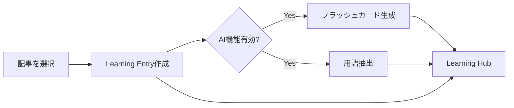

# Learning Hub ユーザーマニュアル

総合的な学習支援ツール - 知識の獲得からレビューまで自動化された学習体験

## 目次

1. [概要](#概要)
2. [クイックスタート](#クイックスタート)
3. [主要機能](#主要機能)
4. [AI機能の使い方](#ai機能の使い方)
5. [Article連携](#article連携)
6. [自動化ワークフロー](#自動化ワークフロー)
7. [ベストプラクティス](#ベストプラクティス)
8. [FAQ](#faq)

---

## 概要

### Learning Hubとは？

Learning Hubは、あなたの学習を総合的にサポートする個人学習プラットフォームです。

**特徴:**
- 📚 **多様なソースからの学習記録** - 本、YouTube、記事、コース、仕事など
- 🤖 **AI支援学習** - フラッシュカード自動生成、用語抽出、要約作成
- 🔄 **間隔反復システム (SM-2)** - 科学的に最適化された復習スケジュール
- 📖 **個人辞書** - 重要な用語とその定義を蓄積
- 📊 **学習進捗追跡** - 統計とマスタリーレベルの可視化

### なぜLearning Hubを使うのか？

| 従来の学習 | Learning Hubを使った学習 |
|-----------|------------------------|
| ノートがバラバラで見返しにくい | 全ての学習が一箇所に集約 |
| 復習のタイミングが分からない | AIが最適なタイミングで通知 |
| 用語の定義を何度も調べる | 個人辞書に蓄積 |
| 学習の進捗が見えない | ダッシュボードで可視化 |
| 手動でフラッシュカード作成 | AIが自動生成 |

---

## クイックスタート

### 1. Learning Hubにアクセス

```
/study → "Learning Hub" バナーをクリック
または直接: /study/learning
```

### 2. 最初の学習エントリを作成

1. **「New Entry」** ボタンをクリック
2. タイトルを入力（例：「React Hooks完全ガイド」）
3. ソースタイプを選択（例：Article）
4. ノートをMarkdown形式で記入
5. **AI機能を有効化**（推奨）:
   - ✅ フラッシュカード生成
   - ✅ 用語抽出
6. **「Create Entry」** をクリック

### 3. 毎日の復習

1. `/study/learning/review` にアクセス
2. 表示されたカードを見て回答を考える
3. **「Show Answer」** をクリック
4. 自己評価を選択:
   - **Again** - 全く思い出せなかった
   - **Hard** - 苦労して思い出した
   - **Good** - 普通に思い出した
   - **Easy** - 即座に思い出した

---

## 主要機能

### 1. 学習エントリ (Learning Entries)

学習した内容を記録する基本単位です。

#### サポートされるソースタイプ

| タイプ | 記録される情報 | 例 |
|-------|---------------|---|
| **Book** | タイトル、著者、章、ページ番号 | 「Clean Code」第3章 |
| **YouTube** | URL、チャンネル、タイムスタンプ | Fireship の動画 |
| **Article** | URL、タイトル、著者 | Medium記事 |
| **Course** | プラットフォーム、コース名、レッスン | Udemy講座 |
| **Podcast** | 番組名、エピソード | Software Engineering Daily |
| **Work** | プロジェクト名、タスク、チーム | 実務での学び |
| **Conference** | イベント名、スピーカー | React Conf 2024 |
| **Documentation** | URL、技術名 | Next.js公式ドキュメント |
| **Conversation** | メモ | 同僚との議論 |

#### エントリの構成要素

```markdown
# エントリ構成

- タイトル（必須）
- ソースタイプ（必須）
- 本文（Markdown形式）
- Key Takeaways（箇条書き）
- タグ
- カテゴリ
- 関連フラッシュカード（自動リンク）
- 関連辞書用語（自動リンク）
```

### 2. フラッシュカード (Flashcards)

#### デッキの管理

**デッキの作成:**
1. `/study/learning/flashcards` にアクセス
2. **「New Deck」** をクリック
3. デッキ名と説明を入力
4. タグを追加（オプション）

**おすすめのデッキ構成:**
```
📁 技術
   ├── 📚 JavaScript基礎
   ├── 📚 React Patterns
   └── 📚 システム設計

📁 ソフトスキル
   ├── 📚 リーダーシップ
   └── 📚 コミュニケーション
```

#### カードの作成方法

**手動作成:**
1. **「New Card」** をクリック
2. Front（質問/プロンプト）を入力
3. Back（答え）を入力
4. 難易度を選択
5. ヒントを追加（オプション）

**AI自動生成:**
1. 💡アイコンをクリック
2. 学習内容をペースト
3. 生成枚数を指定
4. **「Generate Cards」** をクリック

### 3. 個人辞書 (Dictionary)

重要な用語とその定義を蓄積する機能です。

**用語の追加:**
1. `/study/learning/dictionary` にアクセス
2. **「Add Term」** をクリック
3. 用語を入力
4. 定義を書く
5. 使用例を追加（重要！）
6. 関連用語をリンク

**効果的な定義の書き方:**
```markdown
## 例: Dependency Injection

**定義:**
オブジェクトが必要とする依存関係を外部から注入する
デザインパターン。

**使用例:**
constructor(private userService: UserService) {}

**関連用語:**
- Inversion of Control
- Service Container
- Factory Pattern
```

### 4. 間隔反復レビュー (Spaced Repetition)

SM-2アルゴリズムに基づく科学的な復習システムです。

#### レーティングと次回レビュー間隔

| レーティング | 意味 | 次回レビュー |
|------------|------|-------------|
| **Again** (0) | 完全に忘れていた | 1分以内に再出題 |
| **Hard** (1) | かなり苦労した | 1〜10分後 |
| **Good** (2) | 普通に思い出せた | 1〜3日後 |
| **Easy** (3) | 即座に思い出せた | 4日以上後 |

#### マスタリーレベル

```
Level 0: 新規 (New)
Level 1: 学習中 (Learning)
Level 2: 復習中 (Review)
Level 3: 習得中 (Acquiring)
Level 4: ほぼ習得 (Near Mastery)
Level 5: 完全習得 (Mastered)
```

連続して正解するとレベルが上がります。

---

## AI機能の使い方

### 1. フラッシュカード自動生成

**いつ使うか:**
- 長い記事や章を読み終わった後
- 新しい概念を複数学んだ時
- 手動で作るのが面倒な時

**使い方:**
```typescript
// リクエスト例
POST /api/study/learning/ai
{
  "action": "flashcards",
  "content": "学習した内容のテキスト...",
  "count": 5,           // 生成枚数
  "difficulty": "medium" // easy, medium, hard
}
```

**UI経由:**
1. 学習エントリ作成時に「Generate Flashcards」をON
2. または既存のデッキで💡アイコンをクリック

### 2. 用語自動抽出

**いつ使うか:**
- 新しい分野を学び始める時
- 専門用語が多いドキュメントを読んだ時

**使い方:**
```typescript
POST /api/study/learning/ai
{
  "action": "terms",
  "content": "用語を抽出したいテキスト..."
}
```

**結果例:**
```json
{
  "terms": [
    {
      "term": "Microservices",
      "definition": "アプリケーションを小さな独立したサービスに分割するアーキテクチャスタイル",
      "category": "アーキテクチャ"
    },
    ...
  ]
}
```

### 3. サマリー生成

**いつ使うか:**
- 長い記事の要点を把握したい時
- 復習用に短いまとめが欲しい時

**使い方:**
```typescript
POST /api/study/learning/ai
{
  "action": "summary",
  "content": "要約したい長いテキスト..."
}
```

### 4. クイズ生成

**いつ使うか:**
- 学習内容の理解度を確認したい時
- 複数のエントリをまとめて復習したい時

**使い方:**
```typescript
POST /api/study/learning/ai
{
  "action": "quiz",
  "entryIds": ["entry-1", "entry-2", "entry-3"],
  "questionCount": 10
}
```

---

## Article連携

Study SectionのArticleとLearning Hubは密接に連携しています。

### ArticleからLearning Hubへの追加

#### 方法1: 記事ページから直接追加

1. Study Sectionで記事を開く
2. サイドバーの **「Add to Learning Hub」** をクリック
3. オプションを設定:
   - 📝 追加のノート（任意）
   - ✅ フラッシュカード生成
   - ✅ 用語抽出
4. **「Create Entry」** をクリック

#### 自動で行われる処理



**連携されるデータ:**
- 記事タイトル → エントリタイトル
- 記事内容 → エントリ本文
- Key Takeaways → そのまま引き継ぎ
- タグ → そのまま引き継ぎ
- カテゴリ → そのまま引き継ぎ
- 記事ID → linkedArticleIdsにリンク

### おすすめのワークフロー

```
1. Study Sectionで興味のある記事を見つける
      ↓
2. 記事を読む
      ↓
3. 「Add to Learning Hub」で自動インポート
   - フラッシュカード自動生成 ✅
   - 用語抽出 ✅
      ↓
4. 生成されたカードを確認・編集
      ↓
5. 毎日の復習で定着
```

---

## 自動化ワークフロー

Learning Hubは手動操作を最小限に抑え、学習に集中できるよう設計されています。

### 自動化されている機能

| 機能 | 自動化の内容 |
|------|-------------|
| フラッシュカード生成 | コンテンツからAIが自動作成 |
| 用語抽出 | 重要用語をAIが自動識別・定義 |
| 復習スケジューリング | SM-2アルゴリズムが最適な間隔を計算 |
| 進捗追跡 | マスタリーレベルを自動更新 |
| 統計集計 | 学習データを自動集計 |
| 記事インポート | ワンクリックでLearning Hubに追加 |

### Quick Capture - 素早いメモ

移動中や忙しい時でもアイデアを逃さない機能です。

**使い方:**
1. Learning Hubダッシュボードの **「Quick Capture」** セクション
2. 短いメモを入力
3. ソースタイプを選択（任意）
4. URL追加（任意）
5. 後で整理

**ステータス:**
- `pending` - 後で整理が必要
- `processed` - エントリに変換済み
- `archived` - アーカイブ済み

### 統計ダッシュボード

自動的に収集される統計:

```
📊 学習統計
├── 総エントリ数: 45
├── フラッシュカード数: 234
├── 辞書用語数: 89
├── 今日の復習完了: 12/15
├── 連続学習日数: 7日
└── マスター済みカード: 45%
```

---

## ベストプラクティス

### 効果的な学習エントリの作り方

**良い例:**
```markdown
# TypeScriptのジェネリクス型制約

## 学んだこと
- extends キーワードで型制約を定義できる
- 複数の制約は & で結合可能
- keyof と組み合わせてオブジェクトのキーを制限できる

## コード例
function getProperty<T, K extends keyof T>(obj: T, key: K): T[K] {
  return obj[key];
}

## Key Takeaways
- 型安全性を保ちながら柔軟な関数が書ける
- コンパイル時にエラーを検出できる
```

**悪い例:**
```markdown
ジェネリクス勉強した。難しかった。
```

### 復習の習慣化

**推奨スケジュール:**
```
朝: 5-10分の復習セッション
  - 期限切れのカードを優先

夜: 新しい学習 + 復習
  - 新しいエントリの作成
  - その日に作ったカードの初回レビュー
```

### フラッシュカードのコツ

1. **1カード1コンセプト** - 複数の概念を詰め込まない
2. **具体的な質問** - 「Reactとは？」より「useStateの戻り値は？」
3. **コード例を含める** - 抽象的な説明より実例
4. **AI生成後は必ず編集** - 自分の言葉に直す

### 辞書の活用

- **新しい用語に出会ったらすぐ追加**
- **使用例は必ず記入** - 定義だけでは不十分
- **関連用語をリンク** - 知識のネットワーク化

---

## FAQ

### Q: フラッシュカードがたまりすぎて復習が大変

**A:** 以下の対策を試してください:
1. 1日の復習上限を設定（例：30枚）
2. 簡単すぎるカードは削除
3. 似たカードは統合
4. 「Easy」評価を適切に使用（間隔が大きく開く）

### Q: AI生成のカードの質が低い

**A:**
- 入力するコンテンツをより具体的に
- 生成後に必ず編集・削除
- 「medium」難易度から始める
- 技術的な内容はコード例を含める

### Q: 記事からの連携がうまくいかない

**A:**
1. 記事ページを開いているか確認
2. ログイン状態を確認
3. サイドバーに「Learning Hub」セクションがあるか確認
4. ブラウザコンソールでエラーを確認

### Q: 復習アイテムが表示されない

**A:**
- 実際に期限が来ているか確認（nextReviewDate）
- ログイン状態を確認
- ページをリロード
- 新しく作ったカードは翌日以降に出題される場合あり

### Q: 統計が更新されない

**A:**
- 復習完了後にリロード
- ブラウザキャッシュをクリア
- Firebaseとの接続を確認

---

## 次のステップ

Learning Hubをさらに活用するために:

1. **毎日5分の復習を習慣化**
2. **学んだことはすぐにエントリ化**
3. **AI機能を積極的に活用**
4. **記事を読んだら必ずLearning Hubに追加**
5. **週に1回、統計を確認して進捗を把握**

---

## 関連ドキュメント

- [LEARNING_SYSTEM.md](./LEARNING_SYSTEM.md) - 技術仕様書
- [Study Section概要](#) - 学習セクション全体の説明

---

*Last Updated: 2024-12*
