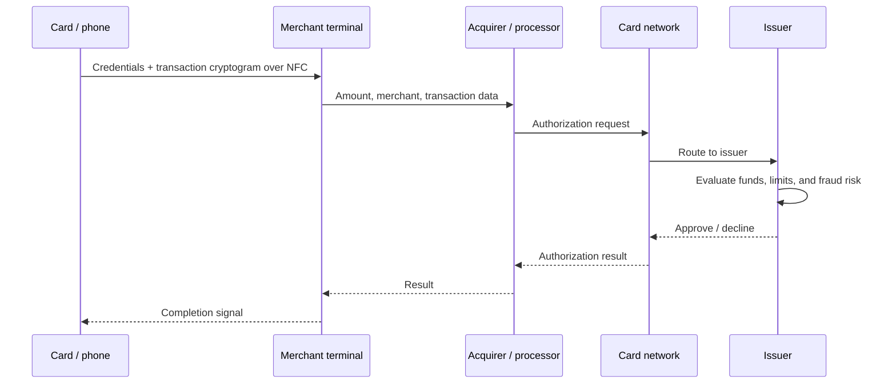
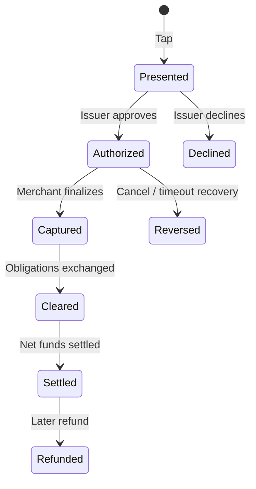

# Inside a Contactless Payment—from NFC to Settlement

> When a card or phone approaches a terminal, NFC carries payment credentials and transaction-specific cryptographic data. The terminal sends an authorization request through the merchant side, the card network, and the issuer. Authorization is not the same as the later clearing and settlement of funds. Japanese version: [blog-how-contactless-payments-work.md](./blog-how-contactless-payments-work.md).

---

## The 30-second answer

That round trip dominates the few seconds at the register. Later, the merchant finalizes transactions and the ecosystem performs **clearing**, which establishes final transaction obligations, and **settlement**, which transfers net funds among the participants.

---

## 1. The tap is a short-range radio conversation

NFC communicates over a distance of a few centimeters. A passive contactless card can obtain operating power from the electromagnetic field produced by the terminal, which is why the card needs no battery. A phone or watch has its own power and uses NFC to behave like a contactless chip card.

The terminal and card or device select an available payment application and exchange the data needed for the transaction. EMV contactless technology generates transaction-specific cryptographic data, including a one-time security code. This differs from repeatedly reading the same fixed magnetic-stripe data and makes simple replay of captured transaction data harder.

It is not accurately pictured as a card continuously shouting its number. Short range, protocol rules, per-transaction cryptography, and terminal risk management work together.

---

## 2. A physical card and a mobile wallet are not identical

A physical chip card uses card-account identification within an EMV transaction. A mobile wallet commonly uses a **payment token**: an alternative value replacing the PAN, or Primary Account Number. Its use can be constrained to a particular device, merchant, or payment context.

Tokenization reduces the value and usable scope of compromised payment data. It does not mean that a token is impossible to steal; it means the token should be harder to reuse than the original unrestricted number.

The phone can also perform cardholder verification through device unlock, fingerprint, face recognition, or passcode. The merchant does not need the biometric itself. The device can bind the fact that local authorization succeeded to the payment flow.

---

## 3. Several roles sit behind the terminal

| Role | Responsibility |
|---|---|
| Cardholder | The person paying |
| Merchant | The business accepting payment |
| Terminal / POS | Combines amount and card or device transaction data |
| Acquirer | The merchant-side financial role accepting card transactions |
| Processor / gateway | Provides communication, format conversion, and possibly risk services |
| Card network | Routes to the appropriate issuer and applies network rules |
| Issuer | Issues the card and manages the account or credit line |

One company may perform several roles, and the exact arrangement differs by country, network, and merchant agreement. The terminal is not broadcasting directly into your bank account.

---

## 4. What the issuer evaluates

In a decision lasting from hundreds of milliseconds to a few seconds, the issuer can combine:

- available funds or credit,
- card or token status and expiration,
- amount, currency, merchant category, and geography,
- recent usage patterns,
- validation of chip-generated transaction cryptography,
- whether additional verification is required,
- proprietary fraud models and risk rules.

A **decline** does not necessarily mean insufficient funds. Connectivity, expiration, risk policy, usage restrictions, and malformed data are other possibilities. The merchant may not receive the issuer's detailed internal reason.

---

## 5. Authorization is not completed settlement

- **Authorization** asks whether this transaction may proceed now.
- **Capture** finalizes an authorized transaction for the merchant.
- **Clearing** exchanges and reconciles final transaction details, including applicable fees.
- **Settlement** transfers the resulting net funds among participants.
- **Refund** is a later, reverse-direction financial operation linked to the original purchase.

Hotels, fuel stations, and restaurant tips can cause the initial authorization and final amount to differ. A banking app's “pending” label reflects this gap.

---

## 6. Why a charge can appear after the terminal showed an error

Suppose the issuer approves the request, then the response connection fails:

- The issuer has approved and may place a hold on available funds.
- The terminal did not receive success and appears to fail.

Reversals and later reconciliation repair this ambiguity. A pending authorization may eventually expire if never captured. Repeating the purchase, however, can create another legitimate authorization.

In a distributed system, “I did not see the response” and “the operation did not happen” are different statements. Messaging retries and email delivery face the same fundamental problem.

---

## 7. Online, offline, and transit speed

Not every transaction necessarily waits for a live issuer response. Depending on amount, connectivity, market and network rules, terminal capability, and card risk parameters, some configurations can make offline decisions or submit data later. Exact policies vary.

Transit gates have an extreme latency requirement. A system can make the minimum gate decision at tap time, then process journey history, daily caps, risk, and payment later. The experience is fast because the design separates work that must block the passenger from work that can safely happen afterward.

---

## 8. For experienced readers: payment engineering

### Idempotency

When a merchant backend retries a payment API after a timeout, it should reuse an idempotency key so the retry does not create a second sale. Authorization, capture, reversal, and refund are distinct state transitions.

### Ledger design

Instead of repeatedly overwriting one “current balance,” preserve append-only entries and derive balances from them. Holds, captures, reversals, refunds, and fees remain separately auditable and reconcilable.

### Reconciliation

Assume that merchant, processor, and acquirer records can disagree about success. Reconcile daily files or API reports against internal orders to detect missing captures, duplicates, amount mismatches, and orphaned refunds.

### Observability without exposing payment data

Monitor authorization rate, latency by issuer or network, timeouts, reversals, duplicate prevention, and missing captures. Do not place PANs, security codes, or track-equivalent data in application logs. Tokenization, masking, least privilege, and PCI DSS scope belong in the architecture from the beginning.

---

## 9. Common misconceptions

| Misconception | Reality |
|---|---|
| Tapping instantly completes a bank transfer | Authorization happens first; capture, clearing, and settlement follow |
| The approval tone means the merchant has received final funds | Terminal acceptance and final settlement are separate |
| NFC alone makes card data perfectly safe | Short range is only one layer; EMV cryptography, tokens, and risk controls also matter |
| A mobile wallet gives the merchant the original card number every time | Payment-token use is common |
| Every decline means insufficient funds | Risk, connectivity, restrictions, expiration, and other reasons exist |

---

## Primary references

- [EMVCo: EMV Contactless Chip](https://www.emvco.com/emv-technologies/emv-contactless-chip/)
- [EMVCo: EMV Payment Tokenisation](https://www.emvco.com/emv-technologies/payment-tokenisation/)
- [EMVCo: What is EMV Chip?](https://www.emvco.com/knowledge-hub/what-is-emv-chip/)
- [PCI SSC: Tokenization Product Security Guidelines](https://www.pcisecuritystandards.org/documents/Tokenization_Guidelines_Info_Supplement.pdf)

---

A contactless payment feels magical not because little work occurs, but because short-range communication, transaction cryptography, tokens, risk decisions, multi-party routing, and later reconciliation are carefully divided into work the shopper must wait for and work that can safely happen afterward.
