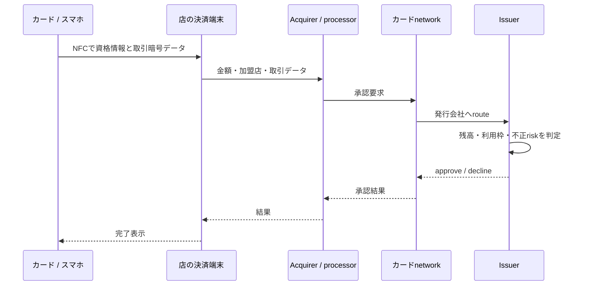
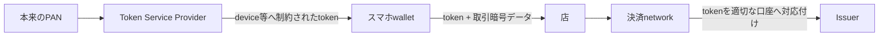
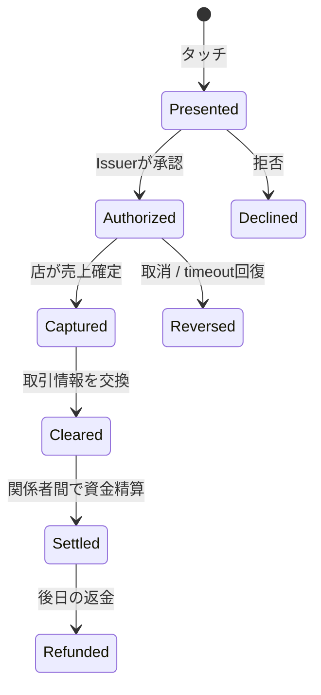

# タッチ決済の数秒間——NFCから売上確定まで

> カードやスマホを端末へ近づけた瞬間、NFCで支払い情報と取引ごとの暗号データが交換される。端末は店、決済代行・加盟店契約会社、カードnetwork、発行会社へ承認を問い合わせる。ただし「承認」と、後で実際に資金を精算する処理は別だ。英語版は [blog-how-contactless-payments-work.en.md](./blog-how-contactless-payments-work.en.md)。

---

## 30秒で分かる答え

この往復が、レジで待つ数秒の主役だ。その後、店は取引をまとめて確定し、**clearing（売上情報の確定・交換）** と **settlement（関係者間の資金精算）** が行われる。

---

## 1. 「タッチ」は近距離の無線会話

NFCは数cm程度の近距離で通信する。非接触カードは、決済端末が作る電磁界から動作に必要なエネルギーを受け取れるため、カード内に電池がなくても応答できる。スマホやwatchは自分の電源を持ち、NFCを使って非接触chip cardのように振る舞う。

端末とcard/deviceは、利用できるpayment applicationを選び、必要な取引データを交換する。EMV contactlessでは、取引ごとに一回限りのsecurity codeに相当する暗号データを生成する。磁気stripeの固定データをただ読み直す方式とは違い、盗み取った一回分を別取引でそのまま再利用しにくくする。

「電波にカード番号を大声で放送し続ける」という絵ではない。通信距離、protocol、取引ごとの暗号計算、端末側risk管理が重なる。

---

## 2. 物理カードとmobile walletは同じではない

物理chip cardではカード口座の識別情報をEMV取引へ使う。一方、mobile walletでは **payment token** が使われることが多い。tokenは本来のPAN（Primary Account Number）を置き換える別の値で、特定device・merchant・支払い場面などに利用範囲を制限できる。

tokenisationの目的は、漏れた決済情報の価値と利用範囲を小さくすることだ。「tokenなら絶対に盗まれない」ではなく、「盗まれても本来の番号より使い回しにくい」設計である。

スマホ側ではさらに、端末のunlock、指紋・顔・passcodeなどでcardholder verificationを行う場合がある。生体情報そのものを店へ送る必要はなく、端末が利用許可を出した結果を支払い処理へ結びつける。

---

## 3. レジの向こうには複数の役者がいる

| 役割 | 何をするか |
|---|---|
| Cardholder | 支払う人 |
| Merchant | 店 |
| Terminal / POS | 金額とcard/deviceの情報をまとめる |
| Acquirer | 加盟店側でcard取引を受ける金融機関・役割 |
| Processor / gateway | 通信、形式変換、risk機能などを提供 |
| Card network | 適切な発行会社へ取引をrouteし、network rulesを適用 |
| Issuer | カードを発行し、口座・利用枠を管理する会社 |

会社ごとに複数の役割を兼ねることがあり、厳密な構成は国・network・merchant契約で変わる。それでも「店から直接あなたの銀行口座へ電波を飛ばしている」わけではない。

---

## 4. Issuerは何を見て承認するのか

発行会社は、数百msから数秒の判断で、たとえば次を組み合わせる。

- 利用可能残高・credit limit
- card/tokenの有効性、停止状態
- 金額、通貨、merchant category、国・地域
- 直前までの利用pattern
- chipが生成した取引暗号データの検証
- 追加認証やonline PINが必要か
- 独自fraud modelとrisk rule

**decline** は必ずしも残高不足を意味しない。通信不良、期限、risk判定、利用制限、形式不整合など複数の理由がある。店員やmerchantが、issuerの内部理由をすべて見られるとは限らない。

---

## 5. 承認は「入金完了」ではない

ここは初心者にも実装者にも重要だ。

- **Authorization**：この金額の取引を進めてよいか、その時点で確認する
- **Capture**：merchantが承認済み取引を売上として確定する
- **Clearing**：手数料などを含む最終取引情報を関係者間で照合する
- **Settlement**：算出したnet金額を関係者間で精算する
- **Refund**：元取引の後に逆向きの資金移動を起こす新しい処理

ホテル、ガソリンスタンド、restaurant tipなどでは、最初の承認額と最終確定額が違うことがある。銀行appの「保留中」は、この時間差を映している。

---

## 6. 「エラーになったのに請求が見える」はなぜ起きる？

端末から承認要求を出し、issuerが承認した直後に応答回線が切れると、二つの世界ができる。

- issuer側：承認したので利用可能額を確保
- terminal側：成功応答を受け取れず、失敗に見える

この曖昧さを直すため、reversal（取消）や後続の照合がある。保留がしばらく見えても、captureされず期限切れで解放される場合がある。逆に、同じ支払いを繰り返すと、別々の正当な承認として扱われる可能性もある。

分散システムでは「応答が見えなかった」と「処理されなかった」は同じではない。これはメッセージ送信やメール再送と同じ難しさだ。

---

## 7. Online、offline、交通系の速さ

常にissuerへonline照会するとは限らない。少額、通信障害、国やnetwork rules、terminal能力、card risk parameterなどにより、offline判断や後送信が可能な構成もある。ただし具体的な許可条件は実装・市場で異なる。

交通改札では通過速度が極端に重要だ。tap時の最低限の判定で通し、network全体の乗車履歴や日次上限、後続決済を後で処理する方式もある。速さは「セキュリティ検査がない」からではなく、**同期して待つ仕事と、後で行う仕事を分ける**ことで作られる。

---

## 8. 経験者向け：支払いを設計・運用する観点

### Idempotency

merchant backendがpayment APIを再試行する時は、注文IDとは別に冪等keyを固定し、timeout後の再試行が二重売上を作らないようにする。authorization、capture、refundはそれぞれ別のstate transitionとして扱う。

### Ledger

「現在残高」という一つの数値だけを上書きするより、append-onlyな仕訳と、その結果としての残高を分ける。承認によるhold、capture、reversal、refund、feeを別entryとして追えると監査とreconciliationがしやすい。

### Reconciliation

merchant、processor、acquirerで「成功」の記録が一致しない前提を置く。日次fileやAPI reportを内部orderと照合し、missing capture、duplicate、amount mismatch、orphan refundを検出する。

### Observabilityと機密情報

見るべきものは承認率、issuer/network別latency、timeout率、reversal率、duplicate防止、capture漏れ。PAN、security code、track dataなどをapplication logへ出してはいけない。token化・mask・権限分離と、PCI DSSの対象範囲を設計段階で考える。

---

## 9. よくある誤解

| 誤解 | 実際 |
|---|---|
| タッチすると口座から即座に送金が完了する | まず承認し、capture・clearing・settlementが後で続く |
| 承認音が鳴ればmerchantへの入金も完了 | 端末の取引受付と最終精算は別 |
| NFCだからcard情報は絶対安全 | 距離が短いだけで安全が完成するわけではなく、EMV暗号、token、risk管理が重なる |
| mobile walletは本物のcard番号を毎回店へ渡す | payment tokenを使う構成が一般的 |
| declineは残高不足 | risk、通信、制限、期限など他の理由もある |

---

## 一次資料

- [EMVCo: EMV Contactless Chip](https://www.emvco.com/emv-technologies/emv-contactless-chip/)
- [EMVCo: EMV Payment Tokenisation](https://www.emvco.com/emv-technologies/payment-tokenisation/)
- [EMVCo: What is EMV Chip?](https://www.emvco.com/knowledge-hub/what-is-emv-chip/)
- [PCI SSC: Tokenization Product Security Guidelines](https://www.pcisecuritystandards.org/documents/Tokenization_Guidelines_Info_Supplement.pdf)

---

タッチ決済の魔法らしさは、仕事が少ないからではない。近距離通信、取引ごとの暗号データ、token、risk判断、複数会社のrouting、後日の照合を、利用者が待つ部分と待たない部分へ巧みに分けているから、数秒に見える。
