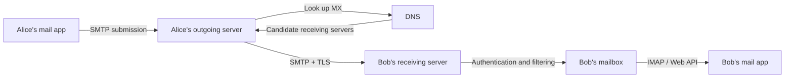
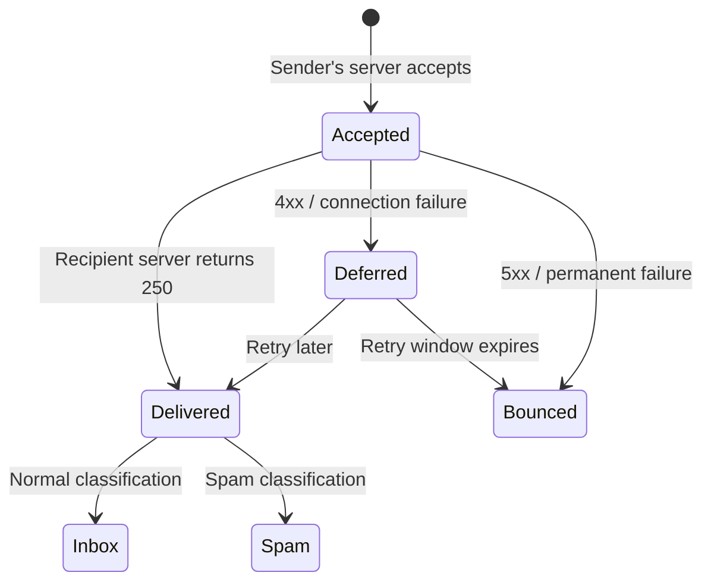
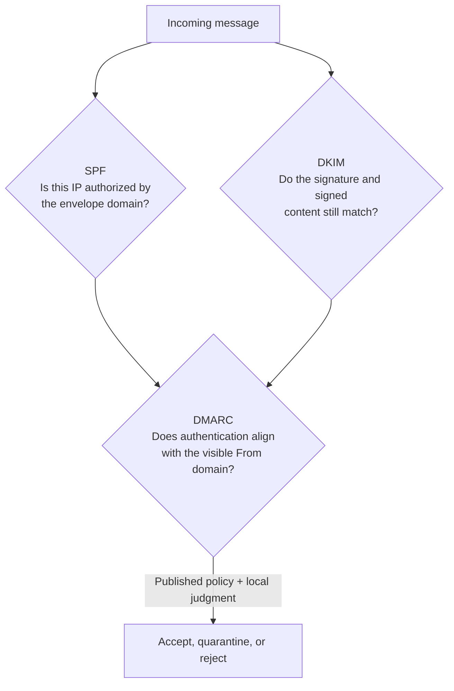

# How Email Actually Works—from Send to Inbox

> Email is not a message fired directly at someone else's phone. It is a **store-and-forward** system: servers act like post offices that look up an address, accept the message, relay it, and place it in a mailbox. Japanese version: [blog-how-email-works.md](./blog-how-email-works.md).

---

## The 30-second answer

When `alice@example.com` writes to `bob@example.net`, this is roughly what happens:

1. Alice's mail app submits the message to her outgoing mail server.
2. That server asks DNS for the mail exchangers—the MX records—for `example.net`.
3. The two servers use SMTP to transfer the message.
4. Bob's provider checks authentication, spam, and malware, then stores the message in his mailbox.
5. Bob's app displays the mailbox through IMAP or a provider-specific web API.



Pressing Send therefore does not mean that Bob has read the message—or even that Bob's provider has received it. It first means that one component has accepted responsibility for the next step.

---

## 1. An email address contains two levels of address

In `bob@example.net`, the part to the left of `@` is the **local-part**; the right side is the **domain**.

- `example.net` identifies the organization to which the message must be routed.
- `bob` identifies a mailbox within that organization.

The sending server first queries DNS for an **MX (Mail eXchanger) record**. MX records list the servers that receive mail for a domain and their priorities. If the preferred server is temporarily unavailable, another candidate may be tried.

Think of the domain as a regional sorting center and the local-part as the named box inside it.

---

## 2. SMTP is the handoff conversation

SMTP, the Simple Mail Transfer Protocol, defines how mail moves in the sending direction. A simplified exchange looks like this:

```text
S: 220 mx.example.net ready
C: EHLO mail.example.com
S: 250 ... capabilities ...
C: MAIL FROM:<alice@example.com>
S: 250 OK
C: RCPT TO:<bob@example.net>
S: 250 OK
C: DATA
S: 354 Send message
C: From: Alice <alice@example.com>
C: To: Bob <bob@example.net>
C: Subject: Hello
C:
C: Message body
C: .
S: 250 Queued
```

`250 Queued` means that the receiving server has accepted responsibility for the message. It does not mean that Bob has opened it.

### Envelope versus letter

Email has two sets of sender and recipient information:

- The **envelope** consists of `MAIL FROM` and `RCPT TO`; servers use it for delivery.
- The visible **headers** include `From:`, `To:`, `Cc:`, and `Subject:`.

This separation enables forwarding, mailing lists, and BCC. A BCC recipient appears in the SMTP envelope but not in the visible recipient headers. The same separation also made it easy to forge a visible `From:` address, which is why SPF, DKIM, and DMARC were added.

---

## 3. MIME assembles bodies and attachments into one message

Internet email began as text. **MIME** gives a message a structure containing plain text, HTML, images, PDFs, and other parts.

```text
Content-Type: multipart/mixed; boundary="abc"

--abc
Content-Type: text/plain; charset="UTF-8"

Hello
--abc
Content-Type: application/pdf
Content-Transfer-Encoding: base64

JVBERi0xLjQK...
--abc--
```

Base64 represents three binary bytes as four text characters, so the encoded data alone grows by roughly one third. Headers and line wrapping add more. That is why a 10 MB attachment produces an email larger than 10 MB.

---

## 4. Why some messages arrive late

Delivery can require multiple attempts.



- A **4xx temporary failure** can mean congestion, temporary policy rejection, or insufficient capacity. The sender retains the message and retries.
- A **5xx permanent failure** can mean that the recipient does not exist or policy forbids delivery. The sender normally generates a bounce.
- After acceptance, the receiving provider can still classify, quarantine, forward, or filter the message.

“Sent,” “accepted by the recipient's provider,” “visible in the inbox,” and “read” are separate states. Ordinary Internet email has no universal, reliable proof that a person read a message. Read receipts and tracking pixels can be blocked and are not conclusive.

---

## 5. SPF, DKIM, and DMARC answer different questions



| Mechanism | What it checks | What it cannot establish alone |
|---|---|---|
| SPF | Whether the connecting IP is authorized for the envelope sender's domain | Whether visible `From:` is genuine or content was modified |
| DKIM | Whether a domain's signature matches selected headers and body content | The author's identity or whether the message is benevolent |
| DMARC | Whether successful SPF or DKIM aligns with the visible From domain | Whether the message's claim is safe or true |

A phisher can register a real domain and correctly authenticate malicious mail from it. Authentication checks the name badge; it does not certify the wearer's intentions.

---

## 6. If TLS encrypts email, can the provider still read it?

TLS commonly protects each network hop, not the entire path from author to reader:

```text
device ==TLS== sender's provider ==TLS== recipient's provider ==TLS== device
               ↑ may process stored plaintext here ↑
```

It is like using a locked container on every delivery truck. It resists eavesdropping in transit, but sorting centers may still access the contents. True **end-to-end encryption** requires technology such as S/MIME or OpenPGP so only endpoint-held keys decrypt the content. Key distribution, account recovery, search, spam filtering, and multi-device use make that model harder to deploy as the default for global email.

---

## 7. For experienced readers: email is a distributed system

### Retries create ambiguity

Suppose the recipient stores a message, but the connection fails before its final success reply reaches the sender. Retrying avoids loss but may create a duplicate. `Message-ID` helps identify duplicates; it is not a global exactly-once guarantee.

### Send order is not delivery order

Two messages may take different routes or spend different lengths of time in retry queues. Sending A before B does not guarantee that A becomes visible first.

### Backpressure lives in queues

If a recipient temporarily rejects delivery, the sender retains work and increases the delay between attempts. At scale, useful signals include queue length, age of the oldest queued message, temporary failures by recipient domain, and categorized bounce rates.

### Reputation sits outside the base protocol

Passing SPF, DKIM, and DMARC does not guarantee inbox placement. Providers also evaluate IP and domain reputation, sudden changes in volume, complaint rates, content patterns, and recipient behavior.

---

## 8. Inspect a real message safely

Use your mail app's “view source,” “show original,” or equivalent command and look for:

1. Multiple `Received:` fields, generally added from bottom to top.
2. `Authentication-Results:` containing `spf=`, `dkim=`, and `dmarc=`.
3. A `Message-ID:`.
4. `Content-Type:` and MIME boundaries.

Do not publish the raw source without redacting it. It can contain personal addresses, internal hostnames, routing details, and authentication-related tokens.

---

## Glossary

| Term | Short definition |
|---|---|
| MUA | The mail app used by a person |
| MSA | A server that accepts submitted outgoing mail |
| MTA | A server role that transfers mail between systems |
| MX | A DNS record identifying a domain's receiving servers |
| SMTP | The protocol for sending and relaying mail |
| IMAP | A protocol for synchronizing and manipulating a server-side mailbox |
| MIME | The structure used for body formats and attachments |

## Primary references

- [RFC 5321: Simple Mail Transfer Protocol](https://www.rfc-editor.org/rfc/rfc5321.html)
- [RFC 5322: Internet Message Format](https://www.rfc-editor.org/rfc/rfc5322.html)
- [RFC 9051: IMAP4rev2](https://www.rfc-editor.org/rfc/rfc9051.html)
- [RFC 6376: DomainKeys Identified Mail (DKIM)](https://www.rfc-editor.org/rfc/rfc6376.html)
- [RFC 7208: Sender Policy Framework (SPF)](https://www.rfc-editor.org/rfc/rfc7208.html)
- [RFC 7489: Domain-based Message Authentication, Reporting, and Conformance (DMARC)](https://www.rfc-editor.org/rfc/rfc7489.html)

---

Email is not simple because it is old. It is an enormous distributed system designed so independently operated servers can keep delivering even when another system is temporarily down. The button press is instant; address resolution, queues, retries, encryption, signatures, and reputation checks continue behind it.
