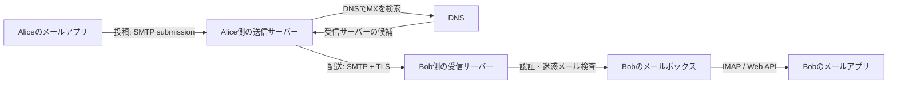
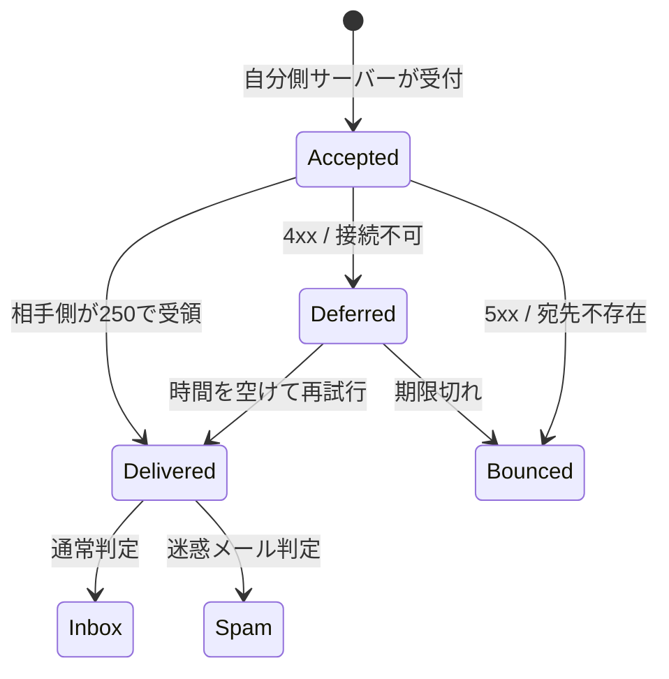
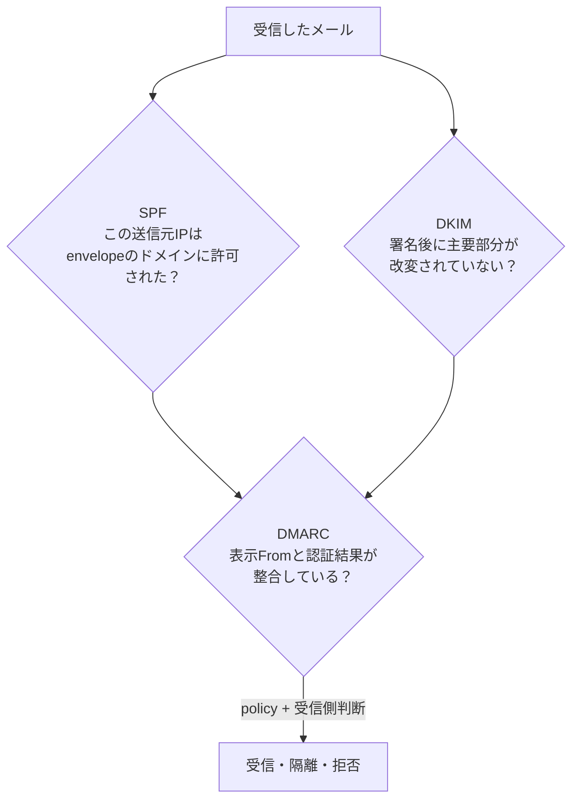

# メールはどう届くのか——送信ボタンから受信トレイまで

> メールは「相手のスマホへ直接飛ぶメッセージ」ではない。複数の郵便局に相当するサーバーが、宛先を調べ、預かり、転送し、相手のメールボックスへ置く **store and forward（蓄積交換）** の仕組みだ。英語版は [blog-how-email-works.en.md](./blog-how-email-works.en.md)。


---

## 30秒で分かる答え

`alice@example.com` が `bob@example.net` へ送るとき、だいたい次のことが起きる。

1. Aliceのメールアプリが、Alice側の送信サーバーへメールを預ける
2. 送信サーバーがDNSで `example.net` のメール受け取り先（MXレコード）を調べる
3. サーバー同士がSMTPで会話し、受信側へ本文を渡す
4. 受信側が迷惑メール判定とウイルス検査を行い、Bobのメールボックスへ保存する
5. BobのアプリがIMAPやWeb APIでメールボックスを表示する



大事なのは、送信ボタンを押した時点で「相手が読んだ」わけでも、必ず「相手のサーバーへ届いた」わけでもないことだ。まず自分側のサーバーが受け付け、そこから配送が続く。

---

## 1. メールアドレスは住所を二つに分けている

`bob@example.net` は、`@` の左が **local-part**（そのドメイン内の受取人）、右が **domain**（配送先を探すための名前）だ。

- `example.net`：どの組織へ運ぶか
- `bob`：その組織のどのメールボックスへ入れるか

送信サーバーは、まずDNSの **MX（Mail eXchanger）レコード**を引く。MXには「このドメイン宛のメールはこのサーバーへ」という候補と優先度が入っている。第一候補が止まっていれば、別候補へ試すこともできる。

これは「宛名から地域の配送センターを見つけ、センター内で個人の箱へ分ける」動きに近い。

---

## 2. SMTPはサーバー同士の受け渡し会話

SMTP（Simple Mail Transfer Protocol）は、メールを**送る方向**の約束だ。概念的な会話は次のようになる。

```text
S: 220 mx.example.net ready
C: EHLO mail.example.com
S: 250 ... capabilities ...
C: MAIL FROM:<alice@example.com>
S: 250 OK
C: RCPT TO:<bob@example.net>
S: 250 OK
C: DATA
S: 354 Send message
C: From: Alice <alice@example.com>
C: To: Bob <bob@example.net>
C: Subject: Hello
C:
C: 本文
C: .
S: 250 Queued
```

`250 Queued` は、受信サーバーが「責任を持って預かった」と答えた状態だ。Bobが開いたという意味ではない。

### 封筒と便箋は別物

SMTPには二種類の宛先がある。

- **Envelope**：`MAIL FROM` と `RCPT TO`。配送に使う、封筒の表面
- **Header**：`From:`、`To:`、`Cc:`、`Subject:`。ユーザーが読む便箋の情報

この区別があるため、メーリングリスト、転送、BCCが成り立つ。BCCの受取人はSMTPの `RCPT TO` にはいるが、表示用ヘッダーには載らない。ただし、封筒と表示が別だからこそ、表示上の `From:` だけを偽ることも昔は容易だった。後述のSPF・DKIM・DMARCが必要になる理由だ。

---

## 3. 本文と添付ファイルはMIMEで「一通」に組み立てる

インターネットメールの基本はテキストだ。HTML本文、画像、PDFを一通へ入れるために **MIME** が、内容を複数のpartへ分ける。

```text
Content-Type: multipart/mixed; boundary="abc"

--abc
Content-Type: text/plain; charset="UTF-8"

こんにちは
--abc
Content-Type: application/pdf
Content-Transfer-Encoding: base64

JVBERi0xLjQK...
--abc--
```

バイナリ添付をBase64にすると、3バイトを4文字で表すため、データ部分は理論上およそ33%大きくなる。さらにヘッダーや改行も加わる。「10 MBのファイルなのにメール全体は10 MBより大きい」のはこのためだ。

---

## 4. なぜすぐ届く時と、遅れて届く時があるのか

メール配送は一回で成功するとは限らない。



- **4xx（一時失敗）**：混雑、容量不足、一時的な拒否。送信側はキューへ残して再試行する
- **5xx（恒久失敗）**：宛先不存在、ポリシー上の拒否など。通常はバウンスメールを返す
- **受領後**：相手側が迷惑メールへ入れる、隔離する、ルールで転送することもある

つまり「送信済み」「配送済み」「受信トレイに表示」「既読」は別々の状態だ。通常のインターネットメールには、相手の既読を確実に証明する共通機構はない。開封確認やトラッキングピクセルは拒否・遮断でき、絶対的な証明にはならない。

---

## 5. SPF・DKIM・DMARCは何を守るのか

三つは競合機能ではなく、別の問いを担当する。



| 仕組み | 確かめるもの | 単独では分からないこと |
|---|---|---|
| SPF | 接続してきたIPが、envelope sender側ドメインの許可リストに合うか | 表示上のFromが本物か、本文が改変されていないか |
| DKIM | ドメインの秘密鍵による署名と、署名対象部分の整合性 | 書いた人の実名、内容が善意か |
| DMARC | SPFまたはDKIMの成功が、表示Fromのドメインと整合するか | そのメールが安全・正しい内容か |

認証に通ってもフィッシングはあり得る。攻撃者が自分で取得した正規ドメインから、正しく署名した詐欺メールを送れるからだ。認証は「名札の検査」であって「人格の保証」ではない。

---

## 6. TLSで暗号化されるなら、運営会社も読めない？

多くの配送経路ではTLSが使われる。しかし通常のメールでTLSが守るのは **通信中の一つの区間** だ。

```text
端末 ==TLS== 自分のメール事業者 ==TLS== 相手の事業者 ==TLS== 相手端末
             ↑ 保存された平文を扱える場合がある ↑
```

これは封書を各輸送車の鍵付き箱に入れるようなものだ。輸送中の盗み見には強いが、郵便局で仕分けするため中身へアクセスできる設計は残る。送信者と受信者だけが復号できる **end-to-end encryption** にはS/MIMEやOpenPGPなどが必要だが、鍵の配布・復旧・検索・迷惑メール検査との両立が難しく、一般メール全体の標準動作にはなっていない。

---

## 7. 経験者向け：メール配送は分散システムである

メールは「HTTPリクエストを一回投げる」より、メッセージキューに近い。

### 再試行と重複

送信側が本文を渡した直後に接続が切れると、相手が保存したのに最終応答だけ届かなかった可能性がある。安全側へ倒して再送すると重複し得る。`Message-ID` は重複判定の手掛かりになるが、グローバルな exactly-once を保証する魔法ではない。

### 順序

別々のメールは異なる経路・再試行回数を通る。「Aを送ってからBを送った」ことと、「Aが先に届く」ことは同じではない。メールは会話単位の厳密な順序配送を保証しない。

### バックプレッシャー

相手側が一時拒否したら、送信側はキューを保持し、間隔を広げて再試行する。大量送信では、キュー長、最古メッセージの滞留時間、ドメイン別の4xx率、バウンス分類が重要な観測値になる。

### 評判もプロトコルの外側で効く

SPF・DKIM・DMARCが全部passでも受信トレイ行きとは限らない。IPやドメインの評判、送信量の急増、苦情率、本文パターン、ユーザー行動など、受信事業者独自の判定が重なる。

---

## 8. 自分のメールで安全に確かめる

メールアプリの「メッセージのソース」「原文を表示」を開くと、次を観察できる。

1. 下から上へ増えていく複数の `Received:` 行
2. `Authentication-Results:` の `spf=`, `dkim=`, `dmarc=`
3. 一意性の手掛かりになる `Message-ID:`
4. `Content-Type:` とMIME boundary

認証用トークン、社内サーバー名、個人のメールアドレスが含まれることがあるため、原文をそのまま公開しないこと。

---

## 用語集

| 用語 | 一言で |
|---|---|
| MUA | ユーザーが使うメールアプリ |
| MSA | ユーザーから送信メールを受け付けるサーバー |
| MTA | サーバー間でメールを転送する役 |
| MX | ドメインの受信サーバーを示すDNSレコード |
| SMTP | メールを送る・転送するプロトコル |
| IMAP | サーバー上のメールボックスを同期・操作するプロトコル |
| MIME | 本文形式や添付を一通へ構造化する仕組み |

## 一次資料

- [RFC 5321: Simple Mail Transfer Protocol](https://www.rfc-editor.org/rfc/rfc5321.html)
- [RFC 5322: Internet Message Format](https://www.rfc-editor.org/rfc/rfc5322.html)
- [RFC 9051: IMAP4rev2](https://www.rfc-editor.org/rfc/rfc9051.html)
- [RFC 6376: DomainKeys Identified Mail (DKIM)](https://www.rfc-editor.org/rfc/rfc6376.html)
- [RFC 7208: Sender Policy Framework (SPF)](https://www.rfc-editor.org/rfc/rfc7208.html)
- [RFC 7489: Domain-based Message Authentication, Reporting, and Conformance (DMARC)](https://www.rfc-editor.org/rfc/rfc7489.html)

---

メールは古いから単純なのではない。異なる会社・異なる実装が、相手が一時的に止まっていても配送を続けられるように作られた、巨大な分散システムだ。「送信」は一瞬でも、その裏では住所解決、キュー、再試行、暗号化、署名、評判判定が協調している。
