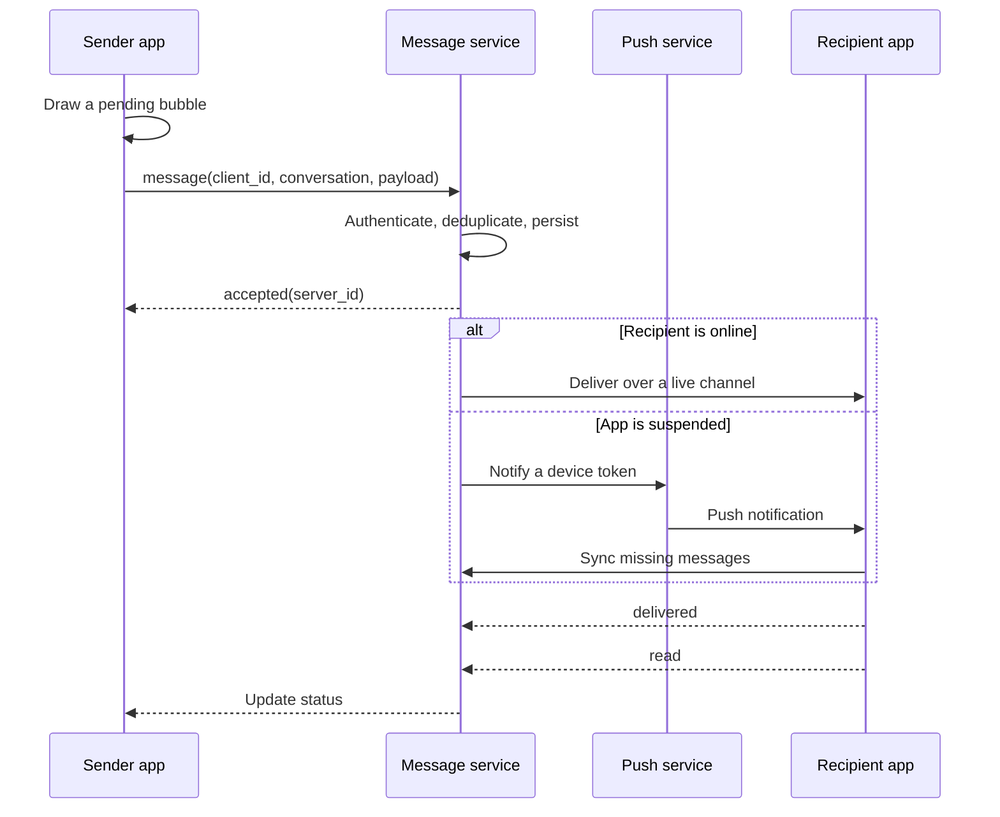
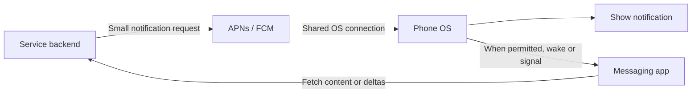
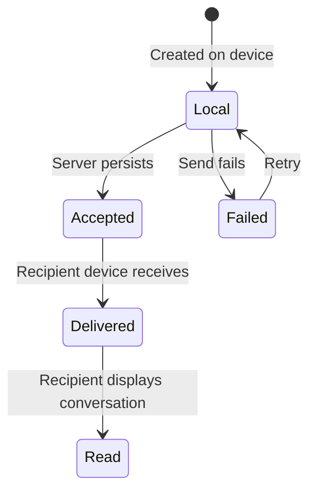
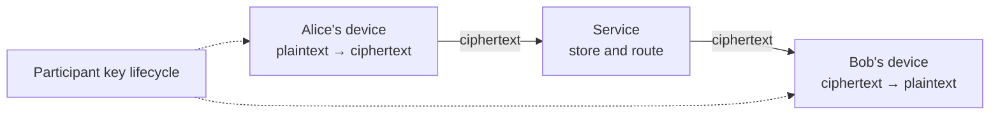

# From Send to Read—What a Messaging App Does

> A chat bubble usually does not travel directly to someone else's screen. The sender's device, the service's servers, push-notification infrastructure, and the recipient's devices cooperate. Even with end-to-end encryption, delivery still needs metadata such as destinations, devices, and timing. Japanese version: [blog-how-messaging-works.md](./blog-how-messaging-works.md).

---

## The 30-second answer

When you press Send, the app assigns a local ID and draws a pending bubble immediately. In the background, it submits the message to a server. The server authenticates the request, stores the message, and fans it out. If the recipient is connected, it uses a live channel. If the app is suspended, the service asks APNs or FCM to announce that data is waiting. The recipient then fetches, decrypts, stores, and acknowledges the message; delivery and read status can travel back.



“Created locally,” “accepted by the service,” “delivered to a device,” and “opened by the recipient” are different facts.

---

## 1. Why the bubble appears instantly

Waiting for the network before drawing the message would make the app feel slow on a train or congested connection. Most messaging interfaces therefore use an **optimistic UI**:

1. Generate a `client_message_id`.
2. Display a pending bubble.
3. Send asynchronously.
4. On success, reconcile it with the server's ID and timestamp.
5. On failure, display a retry action.

The interface feels instant because it predicts success, not because the entire delivery completed instantly.

---

## 2. A live connection and a push notification have different jobs

While the app is open, it can maintain a WebSocket, long-lived HTTP request, or proprietary connection. The server can deliver events without waiting for the app to poll.

Mobile operating systems suspend background apps to preserve battery and memory. An app cannot assume that its private connection will live forever. It therefore uses an OS-level push service.



Push is best understood as a **doorbell**, not the authoritative parcel. A notification may include content, but payload size, privacy, expiration, coalescing, and delivery constraints apply. Apple explicitly describes remote-notification delivery as not guaranteed. Durable state and resynchronization must recover the truth.

---

## 3. IDs prevent a retry from becoming a duplicate

Normal mobile failures include:

- The server stores a message but the connection drops before the success response arrives.
- The sender assumes failure and retries the same content.
- A push signal is duplicated or delayed.
- Several devices synchronize the same conversation concurrently.

Without retries, messages disappear. With blind retries, they duplicate. A common solution uses `client_message_id` as an **idempotency key**.

```text
Unique constraint: (sender_id, client_message_id)

First attempt:
  absent → persist → return server_message_id

Retry:
  already present → do not persist again; return the same result
```

An experience that looks “exactly once” is often built from **at-least-once retries plus receiver-side deduplication**, not from a network that transmits exactly once.

---

## 4. Device clocks alone cannot define message order

Two people can send at almost the same time. Their clocks may disagree and their network paths differ. Sorting exclusively by client timestamps can reorder the conversation.

The server can assign a monotonically increasing sequence per conversation or define a server-observed order.

| Value | Useful for |
|---|---|
| `client_created_at` | Approximate user-facing creation time |
| `server_received_at` | Server-side audit time |
| `conversation_seq` | Stable ordering and gap detection |
| `server_message_id` | Durable identity |

In a large, multi-region group, a strict total order can conflict with latency and availability. Whether order is guaranteed per conversation, per sender, or only on a best-effort basis is a product decision as much as an implementation detail.

---

## 5. Delivery, read status, and typing are messages too



- **Accepted**: the service has taken responsibility.
- **Delivered**: perhaps at least one recipient device received it; definitions vary by product.
- **Read**: the app displayed the relevant point in the conversation. It cannot prove human comprehension.
- **Typing**: an ephemeral presence event that usually does not belong in durable history.

With multiple devices, the product must define whether delivery to any device is enough and how a read on one device propagates to all others.

---

## 6. What end-to-end encryption changes

With E2EE, only participant devices normally hold keys capable of reading message content. The server routes ciphertext.



E2EE does not necessarily make the service oblivious. Delivery may expose **metadata** such as:

- destination accounts and devices,
- send time,
- approximate ciphertext size,
- group membership changes,
- IP addresses and push tokens.

Key lifecycle is the difficult part: adding a new device, revoking a lost one, preventing a removed member from reading future traffic, protecting old traffic after a later compromise, and recovering or backing up keys across devices.

### E2EE versus TLS

- **TLS** encrypts one hop, such as device to server. The server usually handles decrypted data.
- **E2EE** encrypts on the sender's device and decrypts on recipients' devices; the relay normally cannot read content.

They complement each other. E2EE ciphertext is still carried through TLS so intermediaries cannot observe or alter the surrounding connection as easily.

---

## 7. For experienced readers: difficult design choices

### Fan-out on write versus fan-out on read

Expanding a group post into every recipient's inbox at write time makes reads fast but large-group writes expensive. Storing one post and composing per-user state on read makes writes lighter but complicates unread counts, permission changes, and retrieval. Real systems often combine both strategies.

### Offline sync needs more than “the latest N”

A device can send `last_seen_seq`; the server returns later messages plus edits, deletions, reactions, and receipts. A sequence gap triggers repair. A device offline for months may need a snapshot followed by a delta stream.

### Hot conversations

A famous live stream or enormous group can overload the node that assigns conversation order. User IDs are easy to shard, while conversation IDs are where ordering is desired. Choosing the partition boundary is a core scaling trade-off.

### Observability without logging content

Averages hide tail failures. Separate at least:

- client-to-server p50, p95, and p99 acceptance latency,
- acceptance-to-online-delivery latency,
- push-request-to-device-sync latency,
- retries, deduplication, and sequence gaps,
- failures by OS, app version, and network type.

With E2EE, message bodies should not be diagnostic logs. Message IDs, privacy-preserving route labels, phase timestamps, and error classes have to provide enough evidence.

---

## 8. Common misconceptions

| Misconception | Reality |
|---|---|
| A check mark proves the person read it | It may represent acceptance, delivery, or read status; the product defines it |
| If push arrives, the message is safely delivered | Push can be delayed or omitted; app sync is authoritative |
| WebSocket prevents message loss | It is a connection mechanism; persistence, acknowledgements, and retries are application concerns |
| E2EE means the service knows nothing | Content may be hidden while routing metadata remains |
| An exactly-once API eliminates duplicates | Strict exactly-once across boundaries is difficult; idempotent IDs do most of the work |

---

## Primary references

- [RFC 6455: The WebSocket Protocol](https://www.rfc-editor.org/rfc/rfc6455.html)
- [RFC 9420: The Messaging Layer Security (MLS) Protocol](https://www.rfc-editor.org/rfc/rfc9420.html)
- [Apple: Setting up a remote notification server](https://developer.apple.com/documentation/usernotifications/setting-up-a-remote-notification-server)
- [Firebase Cloud Messaging architectural overview](https://firebase.google.com/docs/cloud-messaging/fcm-architecture)

---

A messaging app does not feel reliable because of one fast protocol. Optimistic UI, retryable sends, idempotent storage, sequence numbers, online delivery, push as a doorbell, and delta synchronization combine to create the single experience of “I sent it, and it arrived.”
