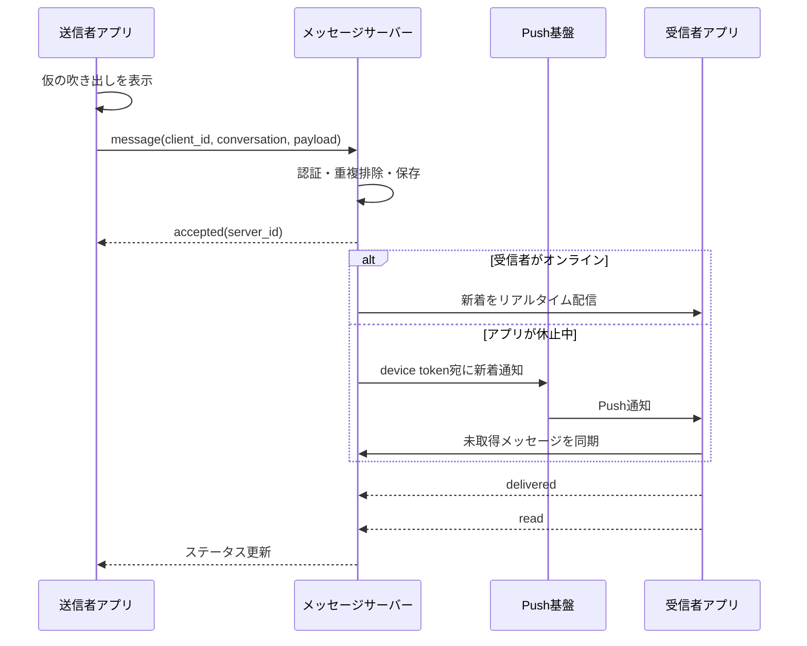
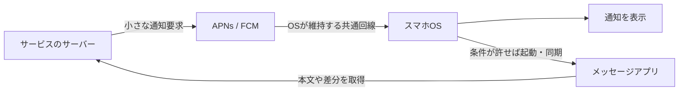
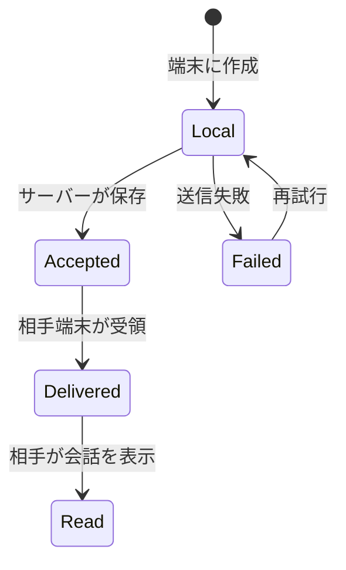
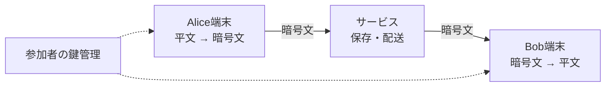

# 「送信」から「既読」まで——メッセージアプリの裏側

> チャットの吹き出しは相手の画面へ直接飛ぶわけではない。多くのサービスでは、送信者の端末、サービスのサーバー、Push通知基盤、受信者の複数端末が協調する。暗号化されたサービスでも、配送そのものには宛先・時刻・端末といったメタデータが必要になる。英語版は [blog-how-messaging-works.en.md](./blog-how-messaging-works.en.md)。

---

## 30秒で分かる答え

送信ボタンを押すと、アプリはローカルなIDを付けてすぐ吹き出しを描き、裏でサーバーへ送る。サーバーは認証・保存・宛先ごとの配信を行う。相手のアプリが接続中ならリアルタイム回線へ流し、休止中ならAPNsやFCMへ「新着がある」と通知する。相手端末はメッセージを取得・復号・保存し、受領確認や既読を返す。



ここで「送信済み」「サーバー受付済み」「相手端末へ配送済み」「相手が開いた」は別々の事実だ。

---

## 1. なぜ押した瞬間に吹き出しが出るのか

通信結果を待ってから表示すると、地下鉄や混雑した回線ではアプリが鈍く感じる。そこで多くのアプリは **optimistic UI** を使う。

1. 端末が `client_message_id` を作る
2. 画面へ「送信中」の吹き出しを置く
3. サーバーへ非同期送信する
4. 成功したらサーバー側IDと時刻へ差し替える
5. 失敗したら再送ボタンやエラー表示へ変える

一瞬で見えるのは通信が一瞬で完了したからではなく、**完了を予測して先に描いた**からだ。

---

## 2. 常時接続とPush通知は別の仕事

アプリを開いている時は、WebSocketのような双方向接続、長時間のHTTP接続、独自の接続方式などでサーバーとつながり続けられる。サーバーは新着を待たずに押し出せる。

しかしスマホOSは、電池とメモリを守るためバックグラウンドアプリを休止する。休止中のアプリが自前の接続を永遠に維持するのは難しい。そこでOSベンダーのPush基盤を使う。



Pushは「荷物本体」より **呼び鈴** と考えると分かりやすい。通知へ本文を含める設計もあるが、サイズ、機密性、失効、重複、配送保証に制約がある。AppleもPush配送を保証していない。重要な状態はサービス側の保存と再同期で回復できるようにする。

---

## 3. 一通を失わず、二重表示もしないためのID

モバイル通信では次が普通に起きる。

- サーバーは保存したが、成功応答が端末へ戻る前に回線が切れた
- 端末が「失敗した」と考えて同じ内容を再送した
- Pushが重複・遅延した
- 複数端末が同じ会話を同時に同期した

再送しなければ欠落し、無条件で再送すれば重複する。そこで送信側が作った `client_message_id` を **idempotency key（冪等キー）** として使う。

```text
(sender_id, client_message_id) に一意制約

初回:
  未登録 → 保存 → server_message_idを返す

再試行:
  登録済み → 新しく保存せず、同じ結果を返す
```

「exactly once（必ず一度だけ）」のように見える体験は、ネットワークが一度だけ運ぶからではない。**at-least-onceで再送し、受信側で重複排除する**ことで作られることが多い。

---

## 4. メッセージの順序は「時刻」だけでは決めにくい

二人がほぼ同時に送ると、端末時計はずれているかもしれず、通信経路も違う。クライアントの時刻だけで並べると順番が入れ替わる。

実用上は、サーバーが会話ごとの単調増加番号を割り当てたり、サーバー受付順を基準にしたりする。

| 値 | 用途 |
|---|---|
| `client_created_at` | ユーザーが入力した頃の表示補助 |
| `server_received_at` | サーバーが受けた監査時刻 |
| `conversation_seq` | 会話内の欠落検出と安定した並び |
| `server_message_id` | 永続的な識別 |

大規模なグループチャットを複数リージョンで処理すると、厳密な全順序は遅延・可用性と衝突する。どの範囲で順序を保証するか——会話単位、送信者単位、あるいはベストエフォート——は製品仕様そのものだ。

---

## 5. 配送・既読・入力中はすべて別メッセージ

画面上は小さなチェックマークでも、裏では状態イベントが流れている。



- **Accepted**：サービスが預かった
- **Delivered**：少なくとも一台の相手端末が受け取った、など。サービスごとに定義が違う
- **Read**：相手アプリが該当位置を表示した、など。人間が内容を理解した証明ではない
- **Typing**：短命な一時イベント。普通は履歴へ永続保存する必要がない

複数端末があると「どの端末への配送をdeliveryとするか」「スマホで読んだ状態をPCへどう反映するか」も決める必要がある。

---

## 6. End-to-end encryptionは何を変えるのか

E2EEでは、本文を読める鍵を基本的に会話参加者の端末だけが持つ。サーバーは暗号文を配送する。



E2EEがあってもサーバーが何も知らないとは限らない。配送には次の **metadata** が残り得る。

- どのアカウント・端末宛か
- いつ送ったか
- 暗号文のおおよそのサイズ
- グループ参加・退出
- IPアドレスやPush token

さらに難しいのは鍵のライフサイクルだ。新端末の追加、紛失端末の失効、グループから外れた人が将来のメッセージを読めないこと、鍵が漏れた後も過去ログを守ること、端末間バックアップを設計しなければならない。

### TLSとの違い

- **TLS**：端末とサーバーなど、一つの通信区間を暗号化。サーバーは通常、復号後のデータを扱える
- **E2EE**：送信者端末で暗号化し、受信者端末で復号。中継サーバーは原則として本文を読めない

両者は代替ではない。E2EEの暗号文もTLSで運び、宛先などの周辺情報を通信途中から守る。

---

## 7. 経験者向け：設計上の難所

### Fan-out on writeか、fan-out on readか

グループへ投稿した時、書き込み時に各受信者の受信箱へ展開すれば読み取りは速いが、大グループの書き込みが重い。投稿を一つだけ保存し、読む時に各ユーザー向けの状態を合成すれば書き込みは軽いが、未読計算や権限変更が難しくなる。実装は両者を組み合わせることが多い。

### Offline syncは「最後のN件」だけでは足りない

端末は `last_seen_seq` を送り、サーバーはその後の差分、削除、編集、reaction、receiptを返す。途中のsequenceが飛んでいれば再取得する。長期間オフラインの端末にはスナップショットと差分を組み合わせる。

### Hot conversation

一つの有名配信や巨大グループへ書き込みが集中すると、会話単位の順序付けノードがホットスポットになる。シャーディングしやすいユーザーIDと、順序を守りたいconversation IDのどちらを分割キーにするかが難しい。

### Observability

平均だけでは障害を隠す。少なくとも次を分けて測る。

- client → server受付のp50 / p95 / p99
- server受付 → online delivery
- Push要求 → 端末同期
- 再送率、重複排除率、sequence gap率
- OS・アプリ版・ネットワーク種別ごとの失敗

E2EEでは本文をログへ出せない、出すべきでない。message ID、匿名化した経路、段階別時刻、エラー分類で診断可能性を作る。

---

## 8. よくある誤解

| 誤解 | 実際 |
|---|---|
| チェックが付いたから相手が読んだ | 受付・配送・既読のどれかは製品定義次第 |
| Push通知が届けば本文も永久に届く | Pushは遅延・省略され得る。アプリの同期が正本 |
| WebSocketならメッセージは失われない | 接続の道具であり、永続化・ACK・再送はアプリ側の責任 |
| E2EEならサービスは何も知らない | 本文は守れても配送メタデータが残る場合がある |
| exactly-once APIを作れば重複しない | 境界をまたぐ厳密なexactly-onceは難しく、IDによる冪等化が中心 |

---

## 一次資料

- [RFC 6455: The WebSocket Protocol](https://www.rfc-editor.org/rfc/rfc6455.html)
- [RFC 9420: The Messaging Layer Security (MLS) Protocol](https://www.rfc-editor.org/rfc/rfc9420.html)
- [Apple: Setting up a remote notification server](https://developer.apple.com/documentation/usernotifications/setting-up-a-remote-notification-server)
- [Firebase Cloud Messaging architectural overview](https://firebase.google.com/docs/cloud-messaging/fcm-architecture)

---

メッセージアプリの速さは、一つの高速な通信方式から生まれるのではない。先に描くUI、再試行できる送信、冪等な保存、順序番号、オンライン配信、Pushという呼び鈴、差分同期が重なって、ようやく「送ったら自然に届く」という一つの体験になる。
