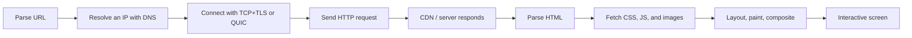
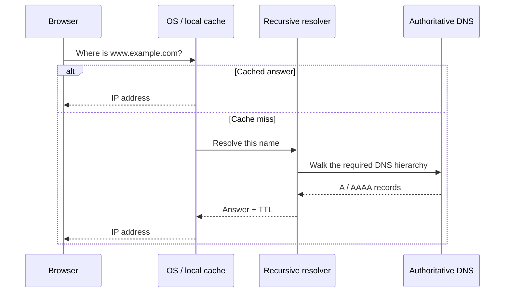
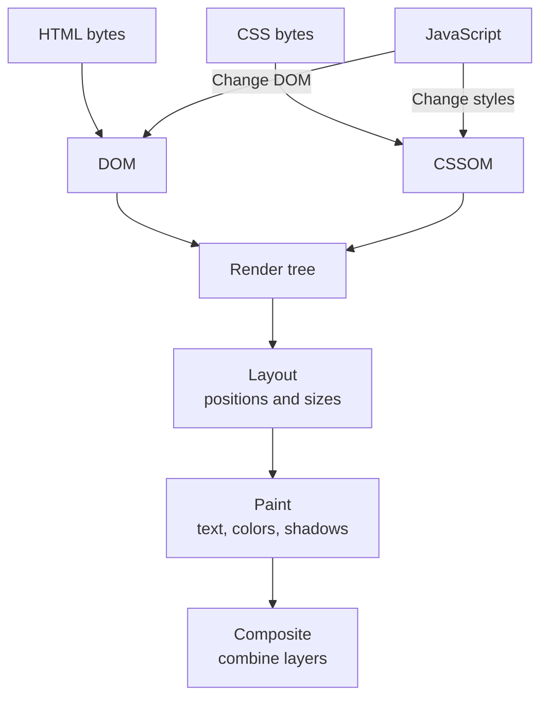
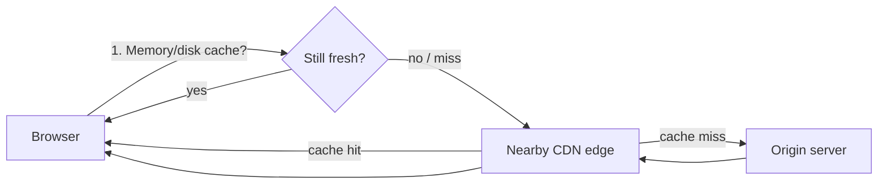

# What Happens When You Open a URL

> A browser first resolves an address, creates a protected connection, receives HTML, discovers CSS, JavaScript, images, and other dependencies, and finally constructs a screen. The server does not necessarily send a finished page. Japanese version: [blog-how-web-works.md](./blog-how-web-works.md).


---

## The 30-second answer

When you open `https://www.example.com/products?id=42#reviews`, the browser first parses the URL:

| Part | Value | Purpose |
|---|---|---|
| scheme | `https` | Communication and security scheme |
| host | `www.example.com` | Name used to locate the destination |
| path | `/products` | Target resource |
| query | `id=42` | Additional request parameters |
| fragment | `reviews` | Browser-side location; normally not sent to the server |

Then the journey looks like this:



Not every phase starts from zero on every visit. Browsers can reuse cached DNS answers, connections, HTML, scripts, and images.

---

## 1. DNS translates a name into a destination

People remember `example.com`; networks route packets to IP addresses. DNS is the distributed database that connects the two.



Resolution may involve root, top-level-domain, and authoritative servers, but recursive resolvers and caches usually do that work for the client. A record's **TTL** indicates how long an answer may be reused.

One domain does not necessarily map to one physical machine. DNS can direct users toward a nearby CDN location or distribute load.

---

## 2. HTTPS prepares encryption and endpoint authentication

Knowing an IP address is not enough. The client needs a protected channel before exchanging private HTTP content.

### A common HTTP/1.1 or HTTP/2 path

1. TCP establishes an ordered, retransmitted byte stream.
2. A TLS handshake negotiates cryptographic parameters.
3. The client validates the server certificate.
4. Both sides derive session keys and carry HTTP inside encryption.

### The HTTP/3 path

HTTP/3 runs over QUIC. QUIC uses UDP underneath but integrates reliability, multiple streams, congestion control, and TLS 1.3 protection. This differs from stacking an independent TLS handshake on a TCP connection.

A valid certificate means that the browser connected to a party controlling a key valid for the domain under the certificate system's rules. It does not guarantee honest content, a high-quality product, or a virtuous operator.

---

## 3. HTTP is a request and response about a resource

A simplified request:

```http
GET /products?id=42 HTTP/1.1
Host: www.example.com
Accept: text/html
Accept-Encoding: br, gzip
Cookie: session=...
```

The response has a status, descriptive headers, and an optional body:

```http
HTTP/1.1 200 OK
Content-Type: text/html; charset=utf-8
Cache-Control: max-age=60
Content-Encoding: br

<!doctype html>...
```

Common status classes:

| Class | Meaning | Examples |
|---|---|---|
| 2xx | Successful handling | `200 OK`, `204 No Content` |
| 3xx | Redirection or cache-related result | `301`, `302`, `304 Not Modified` |
| 4xx | Request or access problem | `400`, `401`, `403`, `404`, `429` |
| 5xx | Server-side processing failure | `500`, `502`, `503`, `504` |

A `404` does not mean “the Internet is down.” The request reached a server capable of explaining that the requested resource was not found.

---

## 4. Receiving HTML is not the same as finishing the screen

The browser parses HTML into a DOM and CSS into a CSSOM. It combines the display-relevant information into a render tree, calculates geometry, paints pixels, and composites layers.



JavaScript can modify the DOM, fetch more data, and register interactions. A long JavaScript task can monopolize the main thread, leaving a visible page unable to respond.

### Server, client, and hybrid rendering

- **Server-side rendering** returns HTML containing useful content, which can improve the initial display.
- **Client-side rendering** returns a shell and uses JavaScript to fetch data and build the view.
- **Hybrid rendering** starts on the server, then handles later navigation and updates on the client.

Measuring HTML download time alone does not measure the complete user experience.

---

## 5. Caches and CDNs avoid work

The fastest request is the request you do not make.



Important controls:

- `Cache-Control: max-age=...` allows reuse while the response is fresh.
- `no-cache` means revalidate before reuse; it does not mean “never store.”
- `no-store` instructs caches not to store the response.
- `ETag` identifies a version; the server can return `304 Not Modified`.
- Content-hashed names such as `app.a1b2c3.js` allow long caching because changed content gets a new URL.

A CDN stores responses at edge locations, reducing physical distance and origin load. Accidentally placing personalized content into a shared cache can leak data, so the cache key is also a security boundary.

---

## 6. Cookies add continuity to otherwise independent requests

HTTP requests are independent. To connect a shopping cart or login across requests, a server can store a small identifier as a Cookie and receive it on later matching requests.

Common controls for a session cookie include:

- `Secure`: transmit it only over HTTPS.
- `HttpOnly`: prevent JavaScript from reading it.
- `SameSite`: restrict when cross-site requests include it.
- Short expiration, rotation, and server-side invalidation on logout.

The cookie need not contain a password. A common design stores a random session identifier while keeping the actual session state on the server.

---

## 7. For experienced readers: both the waterfall and main thread matter

### Network dependency chains

If the browser cannot discover a stylesheet until HTML arrives, and cannot discover a font until that stylesheet arrives, the work becomes serial. Discoverable critical resources, careful preloading, and appropriate image lazy-loading shorten the waterfall.

### HTTP/2 and HTTP/3

HTTP/2 multiplexes streams over one connection, but packet loss in the underlying TCP stream can delay later bytes across that connection. QUIC separates delivery ordering between streams, reducing this transport-level head-of-line blocking. It cannot eliminate congestion or limited bandwidth.

### Main-thread budget

Even a small compressed bundle can be expensive to parse, compile, and execute. Code splitting, dependency reduction, Web Workers, and dividing long tasks improve a different dimension from network transfer.

### Observe each phase

- DNS, connect, TLS, and TTFB.
- FCP and LCP for visible content.
- INP for interaction responsiveness.
- CLS for layout movement.
- Cache-hit ratio, edge-to-origin ratio, and 5xx rate.

Segment p75 and p95 by region, device capability, and network—not just an average from a developer's fast laptop and nearby Wi-Fi.

---

## 8. Inspect it yourself

Open the browser's Network developer tool and reload a page.

1. Select the initial Document and inspect status, headers, and timing.
2. Use the waterfall to identify dependencies.
3. Compare reloads with and without cache disabled.
4. Filter to JavaScript and compare transfer versus resource size.
5. Record Performance and inspect long tasks and layout work.

Do not publicly share a HAR file without review. It can contain authentication cookies, Authorization headers, and personal data.

---

## Primary references

- [RFC 9110: HTTP Semantics](https://www.rfc-editor.org/rfc/rfc9110.html)
- [RFC 8446: TLS 1.3](https://www.rfc-editor.org/rfc/rfc8446.html)
- [RFC 9000: QUIC](https://www.rfc-editor.org/rfc/rfc9000.html)
- [RFC 9114: HTTP/3](https://www.rfc-editor.org/rfc/rfc9114.html)
- [WHATWG HTML Living Standard](https://html.spec.whatwg.org/)

---

A web page is not one file. It is a pipeline of name resolution, connection setup, encryption, requests, caching, parsing, execution, and rendering. The first step in fixing a slow page is to stop saying “the web is slow” and identify which phase is making the user wait.
