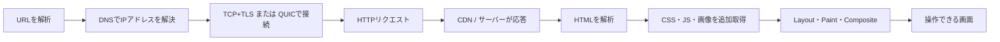
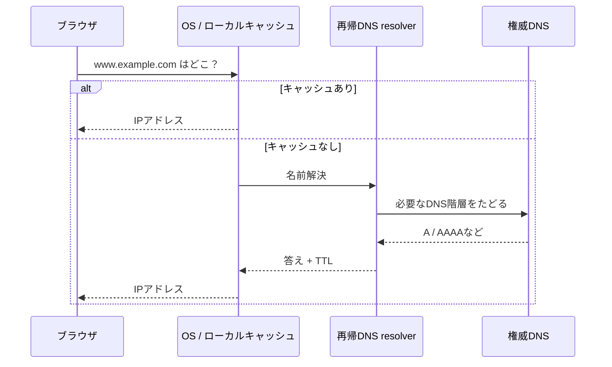
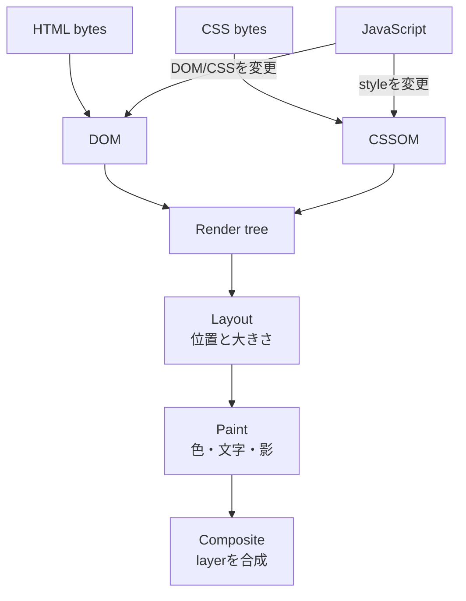
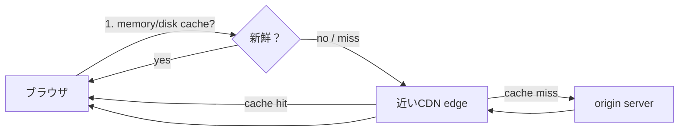

# URLを開いてから画面が出るまで——Webの数秒を分解する

> ブラウザにURLを入れると、まず住所を引き、暗号化された通信路を作り、HTMLを受け取り、そこから必要なCSS・JavaScript・画像を集め、最後に画面を組み立てる。「サーバーが完成画面を送る」とは限らない。英語版は [blog-how-web-works.en.md](./blog-how-web-works.en.md)。

---

## 30秒で分かる答え

`https://www.example.com/products?id=42#reviews` を開くと、ブラウザはURLを分解する。

| 部分 | 値 | 役割 |
|---|---|---|
| scheme | `https` | 通信方式とセキュリティ |
| host | `www.example.com` | 接続先を探す名前 |
| path | `/products` | サーバー上の対象 |
| query | `id=42` | リクエストへ渡す追加条件 |
| fragment | `reviews` | 原則ブラウザ内の位置指定。通常サーバーへ送られない |

その後の全体像はこうなる。



各段階が毎回ゼロから起きるわけではない。DNS、接続、HTML、画像などはキャッシュされ、すでにあるものを再利用できる。

---

## 1. DNSは名前から接続先を探す

人は `example.com` を覚え、ネットワークはIPアドレスへパケットを送る。DNSはその対応を調べる分散データベースだ。



実際にはルート、TLD、権威DNSを段階的にたどることがあるが、普段は再帰resolverとキャッシュが肩代わりする。**TTL** は答えをどれくらい再利用してよいかの目安だ。

一つのドメインが常に一つの物理サーバーを指すとは限らない。利用地域や負荷に応じて近いCDN拠点を返すこともある。

---

## 2. HTTPSは「暗号化」と「相手確認」を準備する

IPアドレスが分かっても、HTTPの内容を送る前に安全な通信路が必要だ。

### HTTP/1.1やHTTP/2で一般的な形

1. TCPで、順序付き・再送ありの接続を作る
2. TLS handshakeで暗号方式を合意する
3. サーバー証明書を検証する
4. セッション鍵を共有し、HTTPを暗号化して運ぶ

### HTTP/3の形

HTTP/3はQUIC上で動く。QUICはUDPを土台にしつつ、信頼性、複数stream、輻輳制御、TLS 1.3相当の保護を一体化する。TCP接続とTLSを別々に積む形とは異なる。

証明書が教えるのは「信頼された仕組みで、このドメイン用の鍵を持つ相手と通信している」ということだ。サイトの内容が善良、商品が高品質、運営者が道徳的という保証ではない。

---

## 3. HTTPはリソースについての要求と応答

簡略化したHTTPリクエストはこう見える。

```http
GET /products?id=42 HTTP/1.1
Host: www.example.com
Accept: text/html
Accept-Encoding: br, gzip
Cookie: session=...
```

応答には状態、説明用ヘッダー、本文がある。

```http
HTTP/1.1 200 OK
Content-Type: text/html; charset=utf-8
Cache-Control: max-age=60
Content-Encoding: br

<!doctype html>...
```

よく見る状態コード：

| 系統 | 意味 | 例 |
|---|---|---|
| 2xx | 成功 | `200 OK`, `204 No Content` |
| 3xx | 別の場所・キャッシュ利用 | `301`, `302`, `304 Not Modified` |
| 4xx | リクエスト側またはアクセスの問題 | `400`, `401`, `403`, `404`, `429` |
| 5xx | サーバー処理の失敗 | `500`, `502`, `503`, `504` |

`404` は「インターネットにつながらない」ではない。サーバーまで会話でき、そのサーバーが該当リソースを見つけられなかったという、かなり具体的な成功だ。

---

## 4. HTMLを受け取っても、画面はまだ完成していない

ブラウザはHTMLを上から解析してDOMを作る。CSSからCSSOMを作り、表示に必要な情報を合わせてrender treeを作る。それから各要素の大きさと位置を計算し、ピクセルへ描き、複数layerを合成する。



JavaScriptはDOMを変え、追加データをAPIから取り、クリック動作を登録する。途中で重いJavaScriptがmain threadを長く占有すれば、見た目が出ていても操作へ反応しない。

### Server renderingとclient rendering

- **Server-side rendering**：サーバーが内容入りHTMLを返す。最初の内容を早く見せやすい
- **Client-side rendering**：最初は骨組みを返し、JavaScriptがデータを取得して画面を作る
- **Hybrid**：最初はサーバー、以後の移動や更新はクライアント。現代のframeworkでよく使う

「HTMLの取得時間」だけ測っても、ユーザーが感じる速さ全体は分からない。

---

## 5. CacheとCDNは「取りに行かない」ための技術

最速の通信は、通信しないことだ。



代表的な制御：

- `Cache-Control: max-age=...`：指定秒数は新鮮として再利用
- `no-cache`：保存禁止ではなく、使う前に再検証
- `no-store`：保存しない
- `ETag`：内容の版を示し、変化がなければ `304 Not Modified`
- version付きファイル名：`app.a1b2c3.js` のように内容が変わればURLも変え、長期cacheを安全に使う

CDNは世界各地のedgeへ静的ファイルや応答を置き、物理距離とorigin負荷を減らす。ただし個人ごとの応答を誤って共有cacheへ入れると情報漏えいになる。cache keyに何を含めるかはセキュリティ設計でもある。

---

## 6. Cookieは「HTTPに記憶を足す」

HTTPリクエストは一回ずつ独立している。ログイン状態やカートを結びつけるため、サーバーは小さな識別子をCookieとして保存させ、同じ範囲の次回リクエストで返させる。

安全なsession Cookieでは一般に次を検討する。

- `Secure`：HTTPSでのみ送る
- `HttpOnly`：JavaScriptから読めなくする
- `SameSite`：cross-site requestで送る条件を制限
- 短い有効期限、rotation、logout時の失効

Cookieにパスワードを保存する必要はない。多くの場合、ランダムなsession IDを置き、実際の状態はサーバー側で管理する。

---

## 7. 経験者向け：速さはwaterfallとmain threadの両方で決まる

### ネットワークの依存関係

HTMLを取るまでCSS URLが分からず、CSSを取るまでfont URLが分からないなら、依存関係が直列になる。重要リソースを早く発見できるHTML、preloadの節度ある利用、画像の適切な遅延読み込みがwaterfallを短くする。

### HTTP/2とHTTP/3

HTTP/2は一接続で複数streamを多重化するが、下のTCPでpacket lossが起きると接続全体の後続byteが待つことがある。QUICはstreamごとの配送順を分離し、このtransport-level head-of-line blockingを減らす。ただし輻輳や帯域不足そのものが消えるわけではない。

### Main-thread budget

転送サイズが小さくても、大量のJavaScriptをparse・compile・executeすれば遅い。code splitting、不要依存の削除、Web Workerへの移動、長いtaskの分割は、ネットワーク最適化と別軸で効く。

### 観測する段階

- DNS、接続、TLS、TTFB（最初のbyteまで）
- FCP / LCP（内容が見えるまで）
- INP（操作への応答）
- CLS（表示中のレイアウトずれ）
- cache hit率、CDN→origin率、5xx率

p50だけでなくp75・p95や、地域、端末性能、回線種別で分ける。開発者の高速PCと近距離Wi-Fiだけでは本番ユーザーの体験は分からない。

---

## 8. 自分で確かめる

ブラウザの開発者ツールでNetworkを開き、ページを再読み込みする。

1. 最初のDocumentを選び、status、headers、timingを見る
2. Waterfallで、どの取得が次の取得を待たせているか見る
3. Disable cacheの有無で二回比較する
4. JS filterで転送量と実行対象を確認する
5. Performance記録でlong taskとlayoutを見る

認証Cookie、Authorization header、個人データを含むHARファイルは、そのまま公開しないこと。

---

## 一次資料

- [RFC 9110: HTTP Semantics](https://www.rfc-editor.org/rfc/rfc9110.html)
- [RFC 8446: TLS 1.3](https://www.rfc-editor.org/rfc/rfc8446.html)
- [RFC 9000: QUIC](https://www.rfc-editor.org/rfc/rfc9000.html)
- [RFC 9114: HTTP/3](https://www.rfc-editor.org/rfc/rfc9114.html)
- [WHATWG HTML Living Standard](https://html.spec.whatwg.org/)

---

Webページは一つのファイルではなく、名前解決、接続、暗号化、要求、cache、解析、実行、描画のpipelineだ。遅いページを直す最初の一歩は「Webが遅い」と一括りにせず、どの段階が待たせているかを分けることである。
