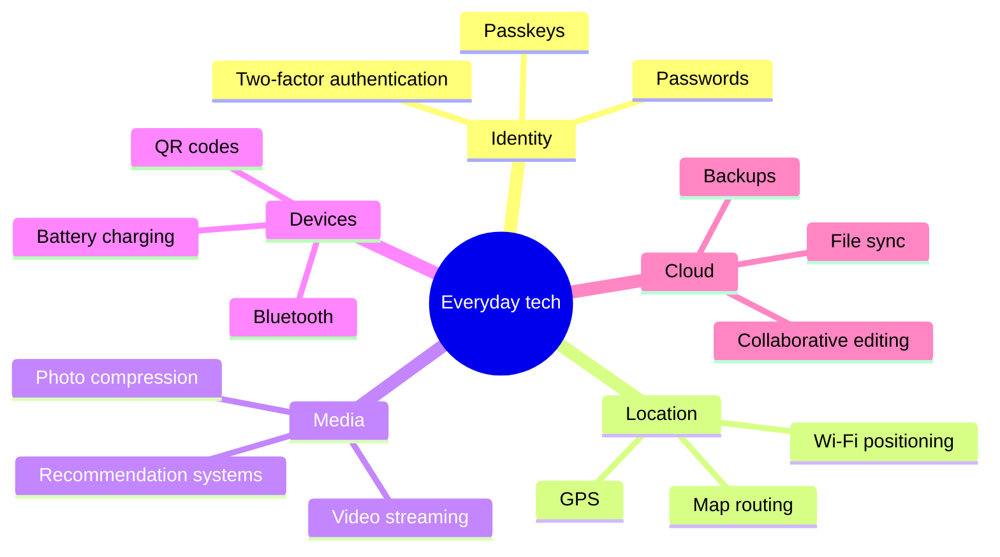

# Everyday Technology, Explained / 日常技術のしくみ

毎日使うのに、送信ボタンの向こう側は意外と見えない。このシリーズは、まず「たとえ」で全体像をつかみ、次に実際の通信経路を追い、最後に設計・障害・セキュリティまで掘る。初心者は前半だけでも読め、経験者は後半を設計レビューの入口として使える構成にしている。

We use these systems every day, yet most of their machinery is hidden behind a button. Each article starts with an analogy, follows the real data path, and then examines design trade-offs, failure modes, and security. Newcomers can stop after the first half; experienced readers can use the later sections as a technical review.

## Published drafts / 作成済み

| Topic | 日本語 | English | What the visualizations explain |
|---|---|---|---|
| Email | [メールはどう届くのか](./blog-how-email-works.md) | [How Email Actually Works](./blog-how-email-works.en.md) | サーバー間配送、認証の役割分担 |
| Messaging | [「送信」から既読まで](./blog-how-messaging-works.md) | [From Send to Read](./blog-how-messaging-works.en.md) | 保存・配信・Push、暗号化とメタデータ |
| Web | [URLを開いてから画面が出るまで](./blog-how-web-works.md) | [What Happens When You Open a URL](./blog-how-web-works.en.md) | DNS・TLS・HTTP・描画、キャッシュ |
| Contactless payments | [タッチ決済の数秒間](./blog-how-contactless-payments-work.md) | [Inside a Contactless Payment](./blog-how-contactless-payments-work.en.md) | NFCから承認まで、売上確定まで |

## Good next topics / 次に相性がよいトピック

次の優先候補は **パスキー**、**GPS**、**クラウド同期**。この3つは「便利さと引き換えに、何を端末・サーバーへ預けているか」という共通軸でつなげやすい。さらに、QRコード、動画配信、Bluetooth、地図の経路探索、写真圧縮、生成AIの推論まで広げれば、独立記事でありながら一つの「日常のコンピューター科学」コースになる。

The strongest next candidates are **passkeys**, **GPS**, and **cloud sync**. They share one useful question: what are we trusting the device or server to hold in exchange for convenience? QR codes, video streaming, Bluetooth, route planning, image compression, and generative-AI inference can then extend the collection into a coherent “computer science of everyday life” course.

## Editorial pattern / 執筆フォーマット

各記事は同じ順番で読めるようにする。

1. 30秒で分かる答え
2. 送信・操作から完了までの図
3. 初心者向けのたとえ
4. 実際のプロトコルとデータ
5. 失敗時に何が起きるか
6. セキュリティとプライバシー
7. 経験者向けの設計論
8. 自分で確かめる方法
9. 用語集と一次資料

Every article follows the same path: a 30-second answer, a visual journey, an analogy, real protocols and data, failure behavior, security and privacy, engineering trade-offs, a safe hands-on check, and primary references.
