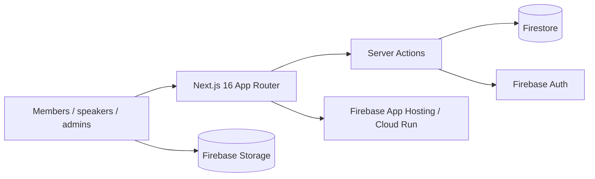
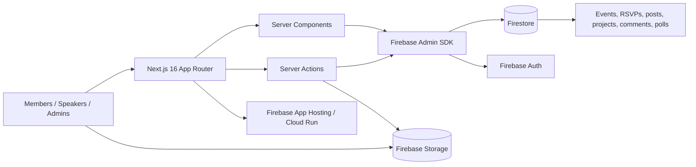
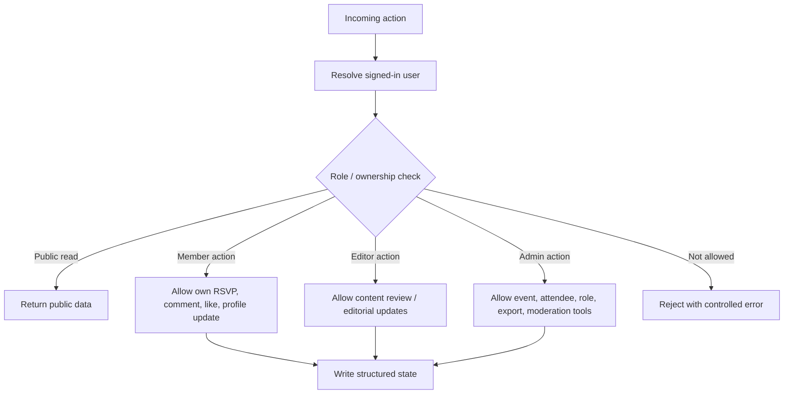
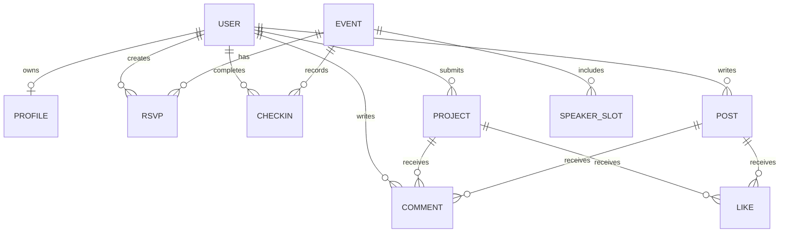
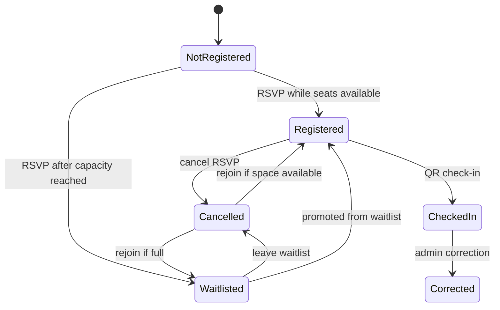
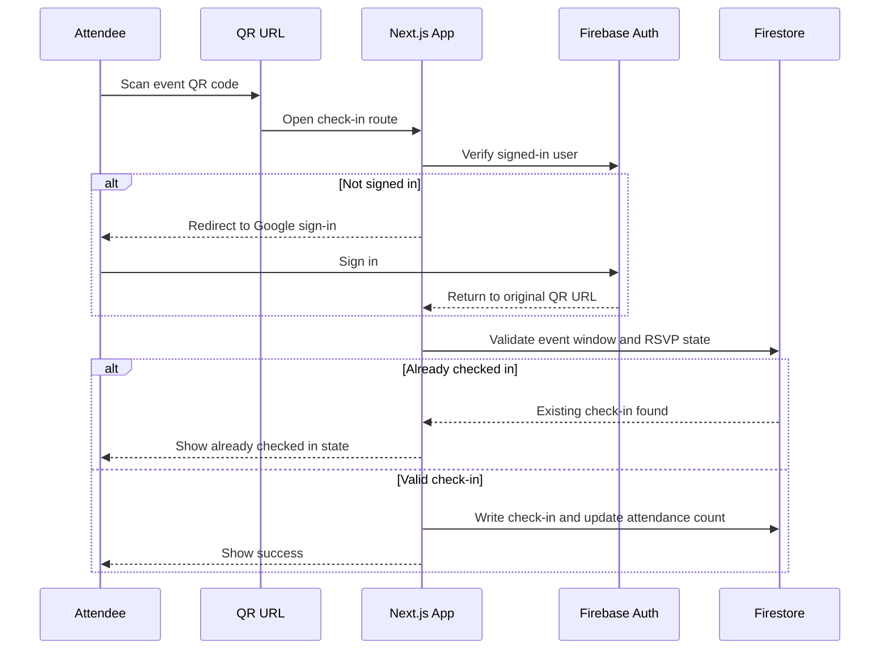
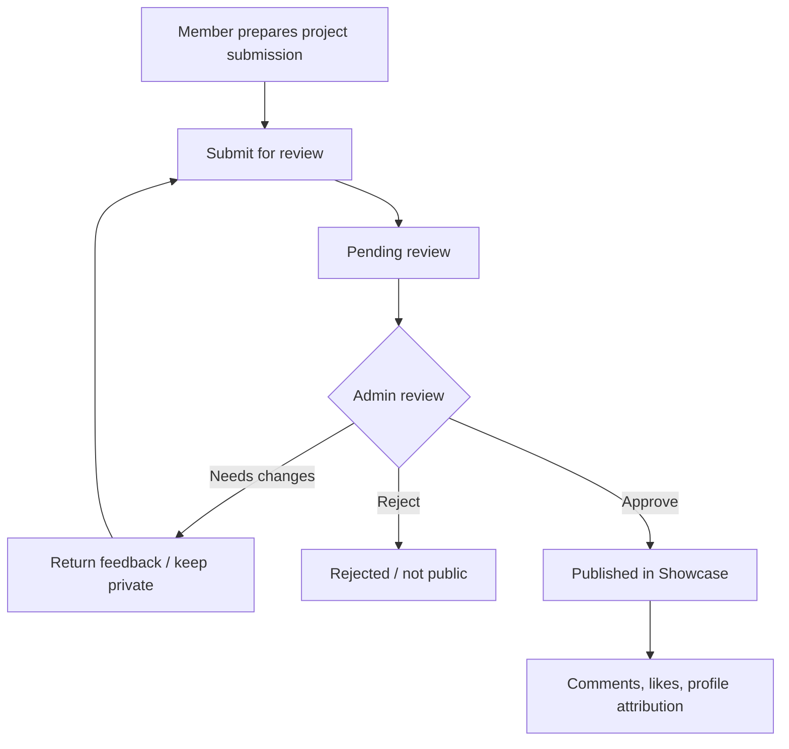
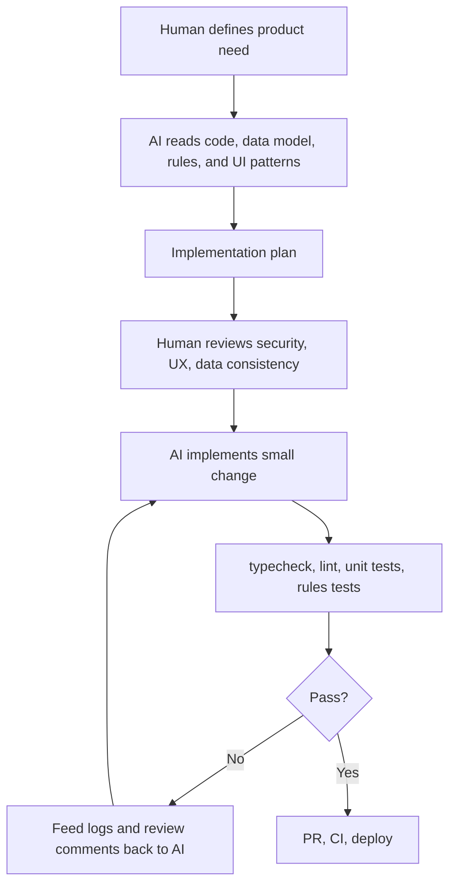
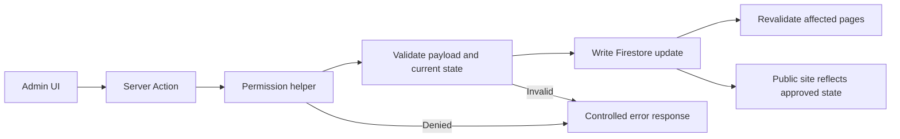
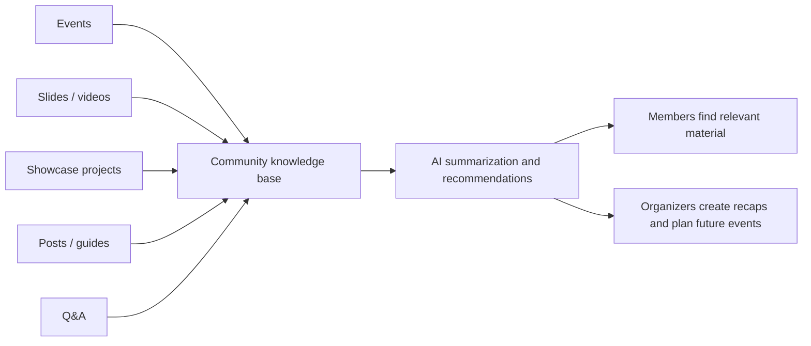

# JTPA Community Hub Portfolio Case Study

This case study content is for adding JTPA Community Hub to meetyudai.com as a portfolio project and, optionally, turning it into a longer blog/case-study page.

Use the short fields for the Projects admin form. Use the full case study for a dedicated post or project detail page.

## Recommended Placement

Primary placement: Projects

Secondary placement: Blog Posts, if you want a longer article about AI-assisted product development.

Do not use Published Writing as the main placement. Published Writing is better for external authored articles such as Atlas Engineering posts. JTPA Community Hub is stronger as a built project.

## Project Admin Fields

Title:

```text
JTPA Community Hub
```

Date:

```text
06/23/2026
```

Client:

```text
JTPA / Bay Area AI
```

Industry:

```text
Community Platform, Event Operations, AI Education
```

Categories:

```text
Web App, AI/ML
```

Technologies:

```text
Next.js 16
React 19
Firebase App Hosting
Cloud Run
Firestore
Firebase Auth
Firebase Storage
Server Actions
TypeScript
i18n
Codex
Claude Code
```

URLs:

```text
Live Site: https://bayarea-ai.com/en
Japanese Showcase: https://bayarea-ai.com/ja/showcase/jtpa-community-hub-ai
Source Code: https://github.com/gomyway1216/JTPA-Main
```

Short project summary:

```text
A bilingual community operations platform for Bay Area AI / JTPA, combining event pages, RSVPs, waitlists, QR check-in, speaker materials, project showcases, member posts, Q&A, comments, likes, admin review workflows, and role-based management.
```

## Project Description For Portfolio Modal

The Projects form accepts Markdown in the Description field, including GitHub-style tables and Mermaid code blocks.

````markdown
## Overview

**JTPA Community Hub** is a bilingual community operations platform I built for Bay Area AI / JTPA. It turns a recurring AI meetup into a structured product: events, RSVPs, waitlists, QR check-in, speaker materials, project showcases, member posts, Q&A, comments, likes, admin reviews, attendee exports, and role-based management live in one place.

The product is built with Next.js 16 App Router, React 19, Firebase App Hosting, Firestore, Firebase Auth, and Firebase Storage. I designed the architecture so core application writes go through server-side actions instead of direct client-side Firestore writes. Authorization is centralized around user/admin/editor helpers, while large file uploads go directly to Firebase Storage and store metadata through controlled server paths.

This project is also a practical example of AI-assisted software development. I used Codex and Claude Code to accelerate implementation, but kept the product decisions, security boundaries, review workflows, and verification loop under human control. AI was most effective when given concrete constraints: existing files to read, local patterns to follow, authorization rules to preserve, and tests to pass.


````

## Full Case Study

# JTPA Community Hub: Building an AI Meetup Platform With AI-Assisted Development

JTPA Community Hub is a bilingual web platform I built for Bay Area AI / JTPA to support recurring AI meetup operations. It is not just a public website. It is the operational layer behind events, RSVPs, waitlists, speaker coordination, QR check-in, project showcases, member posts, Q&A, comments, likes, admin review flows, and community knowledge sharing.

The project started from a practical problem: community work gets fragmented quickly. Event announcements live in one place, RSVPs in another, speaker details in chat, slides in shared folders, follow-up posts in scattered links, and project updates in informal messages. That makes the organizer experience repetitive and the member experience harder than it needs to be.

I wanted one product surface where members could find what is happening, see what others are building, and contribute their own posts or projects, while organizers could manage events and moderation without relying on spreadsheets and ad hoc workflows.

## Product Scope

The platform supports the main workflows needed by a real meetup community:

- Event listings and event detail pages
- RSVPs, waitlists, capacity tracking, and attendee exports
- Speaker registration, talk titles, abstracts, slide links, and video links
- QR-code check-in for event-day attendance
- AI project Showcase submissions
- Admin review flows for submitted projects and posts
- Member blog posts, Q&A, guides, comments, likes, and community polls
- Google sign-in, public profiles, and member dashboards
- Japanese and English localization
- Admin tools for publishing, reviewing, attendance correction, CSV export, and role management

The most important design decision was to treat the site as both a public community site and an internal operations tool. Members should see a simple interface. Organizers need strict state management behind the scenes.

## Why It Matters

Meetups often look simple from the outside: publish an event, collect RSVPs, greet people at the door, and post materials afterward. In practice, the operational state is richer:

- How many people registered?
- Who is waitlisted?
- Who actually attended?
- Which speakers have submitted titles?
- Which posts are pending review?
- Which files belong to which user?
- Which content is public, rejected, or still private?
- Who has permission to approve or edit content?

Those details matter because they affect member experience. If the event is full, waitlist behavior needs to be clear. If a QR check-in link is reused, duplicate attendance should not be counted. If a submitted project is pending review, it should not appear publicly. If an admin corrects attendance, the system should remain consistent.

The product is designed around that kind of operational correctness.

## System Architecture

The app uses Next.js 16 App Router and React 19 on Firebase App Hosting. Firestore stores application data, Firebase Auth handles Google OAuth, and Firebase Storage stores images, slides, and uploaded assets.

A key design choice is that most Firestore reads and writes happen through the server. Server Components load page data. Server Actions handle mutations such as RSVP, waitlist changes, check-in, project submission, approval, comments, likes, and profile updates. The browser does not directly write core application records to Firestore.

Large files use a different path. Images and slides upload directly from the browser to Firebase Storage, then a Server Action records metadata in Firestore. This avoids routing heavy file transfers through the app server while keeping application state controlled.



## Authorization Model

The authorization model is intentionally centralized. Instead of scattering permission checks across UI components, server-side helpers such as `requireUser`, `requireAdmin`, and `requireEditor` define who can perform sensitive operations.

This matters because the same page can contain actions with different risk levels. Viewing an event, joining the waitlist, approving a Showcase submission, exporting attendee data, and editing another user's post should not share the same trust boundary.



## Core Domain Model

The data model centers on community operations rather than isolated pages. Events connect to RSVPs and check-ins. Users connect to profiles, submissions, comments, and likes. Projects and posts connect to review status and public visibility.



## RSVP And Waitlist Flow

RSVP is one of the workflows where a simple UI hides real state management. The system needs to handle capacity, waitlists, cancellation, admin correction, and event-day attendance.



## QR Check-In Flow

QR check-in was more complex than showing a code on screen. It needed event-specific URLs, validity windows, login redirects, duplicate protection, admin correction, and attendance counters.



## Showcase Review Flow

The Showcase feature is designed so members can submit AI projects while admins retain moderation control. Pending or rejected content should not leak into public pages.



## AI-Assisted Development Workflow

Most of the implementation was developed with Codex and Claude Code. I did not use AI as a black-box "build the whole app" button. The effective pattern was to break the product into specific workflows and give AI the relevant files, constraints, expected behavior, and verification commands.

The typical loop looked like this:

1. Define the operational need, such as waitlisted RSVPs, QR check-in, or project review.
2. Ask AI to read the existing data model, Server Actions, Firestore rules, and UI patterns.
3. Review the implementation plan for authorization, data consistency, and failure states.
4. Let AI implement a small, bounded change.
5. Run typecheck, lint, tests, and Firestore/Storage rules tests.
6. Feed test failures, CI logs, and review comments back into AI.
7. Merge only after the behavior and boundaries are clear.



## Where AI Helped Most

AI was most useful when extending established local patterns. Once a pattern existed, Codex and Claude Code could apply it across related features much faster than writing each feature from scratch.

The strongest areas were:

- Firestore schema updates
- Server Actions for mutations
- Admin forms and review screens
- Markdown and rich text editing flows
- i18n copy across Japanese and English
- Tests and rules coverage
- README, help pages, and operational documentation
- Refactoring repeated UI and service patterns

The weaker areas required tighter human review:

- Authorization boundaries
- Firestore security assumptions
- Moderation state transitions
- Cache invalidation behavior
- Event capacity edge cases
- Next.js 16-specific behavior
- User experience tradeoffs for real meetup organizers

## Operational Controls

I treated the admin side as a real operations surface. Actions that affect community state should go through controlled server paths, not informal database edits.



## What Was Hard

The hardest part was balancing a clean community-facing experience with strict operational behavior behind the scenes. The public UI should feel simple. The backend still needs to handle RSVP limits, waitlists, attendance counts, speaker state, approval status, ownership, permissions, file metadata, and localization.

QR check-in was a representative example. A minimal version could simply mark a user as attended, but a reliable version needs duplicate protection, login recovery, event validity windows, admin correction, and consistent attendance totals.

The migration from "community activity spread across many tools" to "one structured product" was also a product design problem. The platform had to match how organizers and members actually behave, not just how the database would prefer them to behave.

## What I Learned

The main lesson is that AI-assisted development works best when the human provides strong constraints. Long prompts are less important than clear boundaries:

- Read these files first.
- Follow this existing pattern.
- Preserve this authorization rule.
- Do not expose pending content publicly.
- Make this operation idempotent.
- Run these tests.
- Keep the UI consistent with this component.

AI can dramatically increase implementation speed, but it does not replace product judgment. Decisions about moderation, event operations, member onboarding, and organizer workflows need to come from understanding the community.

## Outcome

The result is a real, deployed community platform that supports both the public face and operational backbone of Bay Area AI / JTPA. It shows my ability to build full-stack products, model real workflows, design permission boundaries, use Firebase in production, and collaborate with AI tools without giving up engineering control.

## Next Steps

The next phase is to make accumulated community knowledge easier to reuse:

- AI summaries for posts and Q&A
- Automatic event recap generation
- Recommended projects and guides for members
- Organizer analytics for RSVPs, attendance, and content engagement
- Better discovery across events, slides, projects, posts, and questions



## Suggested Visual Assets

Use these as the image set for the project. The first three already exist in the JTPA worktree from the published Showcase material; create or capture the rest as needed.

1. Cover image: product name, community platform, AI meetup operations.
2. Product screenshot: home page or event list.
3. Product screenshot: event detail with RSVP.
4. Product screenshot: Showcase listing.
5. Product screenshot: admin review/dashboard.
6. Architecture diagram.
7. RSVP/waitlist state diagram.
8. QR check-in sequence diagram.
9. Showcase review flow.
10. AI-assisted development loop.
11. Authorization boundary diagram.
12. Future AI knowledge loop.

## Image Generation Prompts

Cover image prompt:

```text
A polished product case study cover for "JTPA Community Hub", showing a bilingual AI meetup community platform on several desktop and mobile screens. Include subtle UI panels for events, RSVP, QR check-in, project showcase, admin review, and community posts. Clean modern SaaS visual style, professional engineering portfolio, white and neutral background with restrained blue and green accents, no fake logos, no excessive gradients, readable interface mockups.
```

Architecture diagram prompt:

```text
A clean technical architecture diagram for a Next.js 16 and Firebase community platform. Show users, Next.js App Router, Server Components, Server Actions, Firebase Admin SDK, Firestore, Firebase Auth, Firebase Storage, and Firebase App Hosting / Cloud Run. Use a professional engineering documentation style with clear labels, enough spacing, and no decorative clutter.
```

Workflow diagram prompt:

```text
A visual workflow diagram showing AI-assisted software development. Stages: human defines product need, AI reads code and constraints, human reviews plan, AI implements small change, tests and CI run, logs and review comments feed back into AI, deploy. Professional portfolio style, clear arrows, compact labels, no long text overflowing boxes.
```

## One-Line Variants

Resume bullet:

```text
Built a bilingual Next.js/Firebase community operations platform for Bay Area AI / JTPA, covering events, RSVPs, QR check-in, project showcases, content review workflows, admin tooling, and AI-assisted development documentation.
```

Homepage project card:

```text
A production community platform for Bay Area AI / JTPA with events, RSVP/waitlist flows, QR check-in, project showcases, content review, bilingual publishing, and Firebase-backed admin operations.
```

Japanese summary:

```text
Bay Area AI / JTPA向けに、イベント運営、RSVP、ウェイトリスト、QRチェックイン、登壇資料、プロジェクト投稿、記事、Q&A、承認フロー、管理画面を統合したNext.js/Firebase製のコミュニティ運営プラットフォームを構築しました。
```
