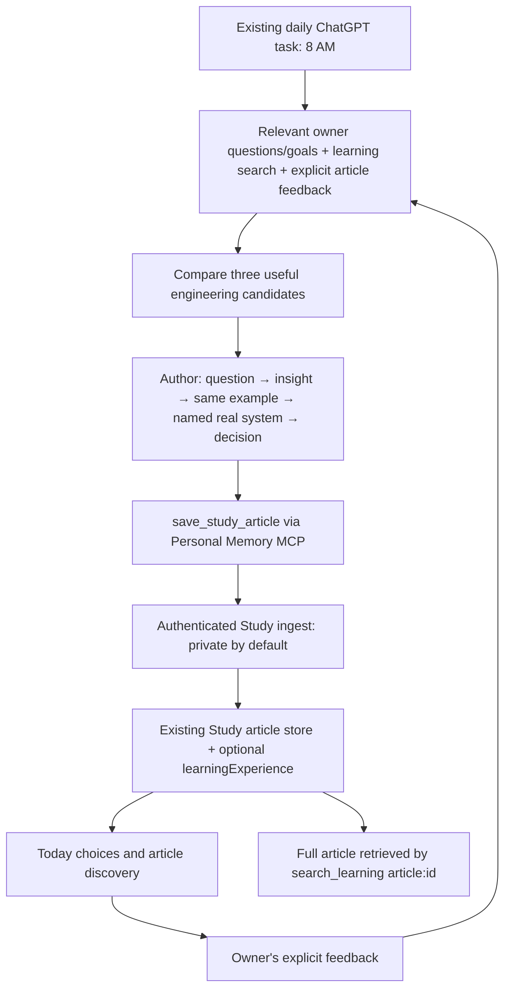

# Curiosity-led learning

## Owner experience

On `/study/learning`, **Today** offers up to three recent articles, unread first. This is a choice of existing articles, not a claim that a ranking algorithm knows the owner's weaknesses. Choosing a question does not write read status, feedback, understanding, or review dates.

New articles can carry `learningExperience`: a concrete question, relevance, a self-contained first insight, optional prediction and experiment, and up to three next questions. The article opens these explanations without requiring an answer. Full sections, diagrams, code examples, and references remain available; the short entry does not replace the body or impose a five-minute limit.

In the **Library**, opening an existing learning keeps its explanation, diagrams, and references. Optional starting questions differ for English, finance/society, and engineering/other material. They open the existing AI handoff dialog, including item ID and revision. Article follow-ups include article ID and request full-text retrieval. Nothing is sent to an AI automatically. The owner chooses to copy it into their usual client.

There are no new paid generation calls, mandatory quizzes, streaks, or automatic mastery/review changes. Existing explicit feedback and review controls retain their meaning.

## Actual authoring path

The cloud task's instructions were updated separately from this repository. MCP guidance advertises the same approach to connected authors. Neither is a deterministic server-side recommendation engine or model training. Selecting a topic still depends on the author actually retrieving the context and following the instructions. Feedback is a preference signal; unread does not mean disliked, and missing learning records do not establish ignorance. Daily articles remain engineering-only; the learning library remains cross-domain.

## Compatibility and verification

- Old articles without valid `learningExperience` keep their title, summary, and full body. No bulk rewrite or inferred mastery.
- New metadata is validated and allowlisted by the backend and is included in the educational full-text read/hash.
- Existing owner-only authentication remains unchanged. Personal selection evidence must not be copied into educational fields.
- Check Today, open a new article, reveal an insight/prediction, follow a section, and try an optional next question. Copying should contain the real article ID, not claim retrieval already happened.
- Open an English or finance note: questions should fit its domain; original diagrams and explicit review state must remain intact.
- Unit tests cover legacy fallback, choice order, domain questions, optional disclosure, and article handoff. Real article usefulness is still judged by the owner, not asserted by the tests.
